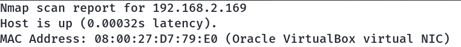
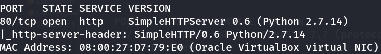

# Matrix: 1

- **Machine:** Matrix: 1
- **Download:** https://www.vulnhub.com/entry/momentum-1,685/


---

# Setup

1. Extract the downloaded archive.
2. Import the `.ova` file into VirtualBox.
3. Click **Finish**.
4. Start the virtual machine.

---

# Network Scanning

## Discover the Target IP

```bash
nmap -sn 192.168.2.0/24
```



---

## Full Nmap Scan

Run a full scan to enumerate open ports, services, operating system information, and default NSE scripts.

```bash
nmap -v -Pn -sT -sV -sC -A -O -p- 192.168.2.169
```


---

## Optional Port Scan

```bash
nmap -v -p- 192.168.2.169
```

```bash
nmap -sC -sV -A 192.168.2.169
```

---

## HTTP Enumeration

Run the HTTP enumeration script.

```bash
nmap -v -p 80 -sT -sV -A --script=http-enum.nse 192.168.2.169
```



---

# Web Enumeration

Visit the web server.

- http://192.168.2.169/
